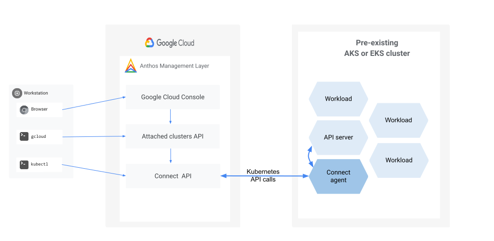

# Using Terraform with GKE Attached Clusters

The scripts provided here demonstrate how you can use Terraform to automate the process of
creating, bootstrapping, and attaching a Kubernetes cluster. For a complete reference of the
GKE attached clusters Terraform resource, see the
[google_container_attached_cluster](https://registry.terraform.io/providers/hashicorp/google/latest/docs/resources/container_attached_cluster)
and
[google_container_attached_install_manifest](https://registry.terraform.io/providers/hashicorp/google/latest/docs/data-sources/container_attached_install_manifest)
documentation.

With GKE attached clusters you can manage any standard, [CNCF-compliant](https://www.cncf.io/certification/software-conformance/)
Kubernetes installation, including clusters already in production. You can then add
[Google Kubernetes Engine (GKE) Enterprise edition](https://cloud.google.com/kubernetes-engine)
features to standardize and secure your clusters across multiple cloud environments and Kubernetes
vendors. To learn more, see the
[GKE attached clusters documentation](https://cloud.google.com/anthos/clusters/docs/multi-cloud/attached).



## High Level Process

Attaching a cluster in GKE involves taking the steps below. The Terraform scripts provided in this
github repository automatically perform steps 1-4, and are meant to provide a quick start to
working with GKE attached clusters.
1. Create a cluster.
1. Invoke the [GenerateAttachedClustersInstallManifest](https://cloud.google.com/anthos/clusters/docs/multi-cloud/reference/rest/v1/projects.locations/generateAttachedClusterInstallManifest)
  API to  retrieve a manifest of the bootstrapping deployment.
1. Apply the manifest from step 1 to the cluster.
1. Invoke the [Create](https://cloud.google.com/anthos/clusters/docs/multi-cloud/reference/rest/v1/projects.locations.attachedClusters/create)
  API to attach the cluster.
1. (Optional) Delete the resources applied in step 2.

## What Is Provided

* The **AKS** folder contains a sample script for creating an AKS cluster on Azure and attaching it.
* The **EKS** folder contains a sample script for creating an EKS cluster on AWS and attaching it.
* The **modules** folder contains the `attached-install-manifest` module which demonstrates how to
retrieve the manifest and apply it to the cluster using Helm. Both the AKS and EKS examples use it.

## Prerequisites

All samples assume the availability of ambient credentials, which are the default credentials
automatically provided in the environment where you run the Terraform scripts. These credentials
are typically obtained by authenticating your account using the Google Cloud SDK (gcloud) with the
command `gcloud auth application-default login`. See the
[documentation](https://cloud.google.com/sdk/gcloud/reference/auth/application-default/login)
for more information.

The prerequisites for running the Terraform scripts are the following:
1. Ensure the latest version of gcloud is [installed](https://cloud.google.com/sdk/docs/install).
1. If you haven't already done so, [create](https://cloud.google.com/resource-manager/docs/creating-managing-projects#creating_a_project)
  your Google Cloud project. This generates a Google Cloud project ID and a project number.
1. Set your active Google Cloud project and authenticate your account with the following commands:
    ```sh
    export PROJECT_ID=<your project id>
    gcloud auth login
    gcloud config set project $PROJECT_ID
    gcloud auth application-default login
    ```
1. Enable the GKE attached clusters API and its required services with the following commands:
    ```sh
    gcloud services enable gkemulticloud.googleapis.com
    gcloud services enable gkeconnect.googleapis.com
    gcloud services enable connectgateway.googleapis.com
    gcloud services enable cloudresourcemanager.googleapis.com
    gcloud services enable anthos.googleapis.com
    gcloud services enable logging.googleapis.com
    gcloud services enable monitoring.googleapis.com
    gcloud services enable opsconfigmonitoring.googleapis.com
    ```
1. Clusters will be created at a specific Kubernetes version. Attached clusters have an additional
  platform version that must be specified. The platform version’s _major.minor_ should match the
  cluster’s Kubernetes version. Both versions must be specified when attaching.
  You can list all supported platform versions using:
    ```sh
    gcloud container attached get-server-config --location=GOOGLE_CLOUD_REGION
    ```
	There is also a Terraform data source that provides the same information:
    ```
    data "google_container_attached_versions" "versions" {
      location      = GCP_LOCATION
      project       = GCP_PROJECT_ID
    }
    ```
