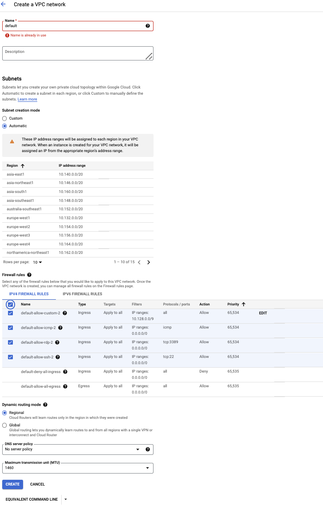
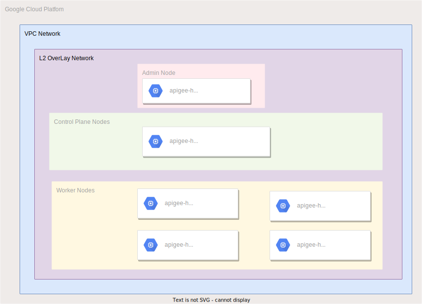

## Apigee on Anthos Baremetal on Google Compute Engine VMs with Terraform

This repository shows you how to use Terraform to try Anthos clusters on bare metal in High Availability (HA) mode using Virtual Machines (VMs) running on Compute Engine. For information about how to use the `gcloud` command-line tool to try this, see [Try Anthos clusters on bare metal on Compute Engine VMs](https://cloud.google.com/anthos/clusters/docs/bare-metal/1.6/try/gce-vms).

### Pre-requisites

- A workstation with access to internet _(i.e. Google Cloud APIs)_ with the following installed
  - [Git](https://www.atlassian.com/git/tutorials/install-git)
  - [Google Cloud SDK](https://cloud.google.com/sdk/docs/install)
  - [Terraform](https://learn.hashicorp.com/tutorials/terraform/install-cli) (>= v0.15.5, < v1.1)

- A [Google Cloud Project](https://console.cloud.google.com/cloud-resource-manager?_ga=2.187862184.1029435410.1614837439-1338907320.1614299892) _(in which the resources for the setup will be provisioned)_

- Enable Compute Engine API Services and Apigee API Services.

- Prerequisite Script - A script is provided under resources folder that can execute  prerequisites. 
```bash
./resources/run_prerequisite.sh
```

- Execute Prerequisite manually 

    * A [Service Account](https://cloud.google.com/iam/docs/creating-managing-service-accounts) in the project that satisfies **one** of the following requirements and its **[key file downloaded](docs/create_sa_key.md)** to the workstation:
  - The Service Account has `Owner` permissions
  - The Service Account has both `Editor` and `Project IAM Admin` permissions
 
  The scripts to create service account and key creation is also mentioned in Quickstart module. 
 
    * Organizational Policy Constraints 
 
      Follwowing list of Policy needs to be enabled for the organizations. If these are not enabled at Organizations, please consider them for the project.

      |  Policy Name                                 | Constraint Name                                   | Effective Polciy |
      |  ------------------------------------------- | ------------------------------------------------- | ---------------- |
      | Disable service account creation             | constraints/iam.disableServiceAccountCreation	   | Not Enforced     |
      | Disable service account key creation         | constraints/iam.disableServiceAccountKeyCreation	 | Not enforced     |
      | Restrict VM IP Forwarding                    | constraints/compute.vmCanIpForward	               | Allowed All      | 
      | Define allowed external IPs for VM instances | constraints/compute.vmExternalIpAccess	           | Allowed All      |
      | Shielded VMs                                 | constraints/compute.requireShieldedVm	           | Not Enforced     |
      | Require OS Login                             | constraints/compute.requireOsLogin	               | Not Enforced     |
      | Skip default network creation                | constraints/compute.skipDefaultNetworkCreation	   | Not Enforced     |


    * default Network with default Firewall policies 

      The installation requires a network with name as default. If default network creation is enabled for the organization, the project will get them inherited. In case the  Skip default network creation is Enforced, you can create a new VPC network with name default in auto mode. 

      

    * Quota Check 

The demo Apigee instance requires 5 VMs with n1-standard-8 machine type. Please ensure there are enough quota set for CPU,Memory, IP Addresses for the region you are hosting the project.


### Bare metal infrastructure on Google Cloud using Compute Engine VMs

The [Quick starter](docs/quickstart.md) guide sets up the following infrastructure in Google Cloud using Compute Engine VMs. The diagram assumes that the none of the default values for the [variables](variables.tf) were changed other than the ones mentioned in the quick starter.



---
## Getting started

- [Terraform Module Information _(includes variables definitions)_](docs/variables.md)
- [Quick starter guide](docs/quickstart.md):
    - The terraform script sets up the GCE VM environment. The output of the script prints out the commands to follow to install **Anthos on bare metal** in the provisioned GCE VMs.
- [All in one install](docs/one_click_install.md):
    - The terraform script sets up the GCE VM environment and also triggers the **Anthos on bare metal** installation on the provisioned GCE VMs. The output of the script prints out the commands to SSH into the *admin workstation VM* and monitor the Anthos on bare metal installation process.


---
## Contributing

#### Pre-requisites
- The same [pre-requisites](#pre-requisites) to run this sample is required for testing as well

#### Pull requests
- For improvements to this sample submit your pull requests to the `main` branch

#### Testing
- Ensure that the improvements have _unit/integration tests_ where appropriate
- To run the existing tests you have to set two environment variables
```bash
export GOOGLE_CLOUD_PROJECT="<YOUR_GOOGLE_CLOUD_PROJECT>"
export GOOGLE_APPLICATION_CREDENTIALS="<PATH_TO_THE_SERVICE_ACCOUNT_KEY_FILE>"
```
- Move into the test directory and recursively execute the tests
```bash
cd anthos-bm-gcp-terraform/test
go test -v -timeout 30m ./...
```
