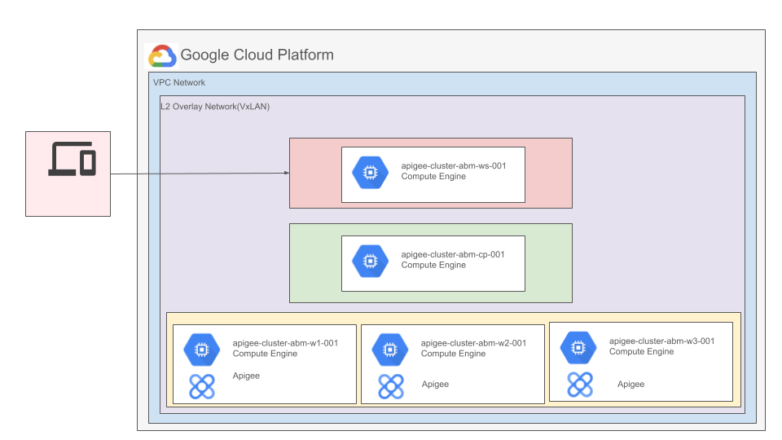

## Apigee Hybrid on Anthos Baremetal on Google Compute Engine VMs with Terraform

This is a sample Apigee Hybrid installation on Anthos Cluster on bare metal running on GCE Virtual Machines. [Apigee hybrid](https://cloud.google.com/apigee/docs/hybrid/v1.7/what-is-hybrid) is a platform for developing and managing API proxies that features a hybrid deployment model. The hybrid model includes a management plane hosted by Apigee in the Cloud and a runtime plane that you install and manage on one of the [supported Kubernetes platforms](https://cloud.google.com/apigee/docs/hybrid/supported-platforms). An [Apigee organization](https://cloud.google.com/apigee/docs/api-platform/fundamentals/organization-structure) is the top-level container in Apigee. It contains all your API proxies and related resources. This installation will create an evaluation Apigee Organization with the name same as GCP Project id.

### Pre-requisites

- A workstation with access to internet _(i.e. Google Cloud APIs)_ with the following installed
  - [Git](https://www.atlassian.com/git/tutorials/install-git)
  - [Google Cloud SDK](https://cloud.google.com/sdk/docs/install)
  - [Terraform](https://learn.hashicorp.com/tutorials/terraform/install-cli) (>= v0.15.5, < v1.2)

- A [Google Cloud Project](https://console.cloud.google.com/cloud-resource-manager?_ga=2.187862184.1029435410.1614837439-1338907320.1614299892) _(in which the resources for the setup will be provisioned)_

- Ensure that the default Compute Engine developer account has Editor role.

- A [Service Account](https://cloud.google.com/iam/docs/creating-managing-service-accounts) in the project that satisfies **one** of the following requirements and its **[key file downloaded](docs/create_sa_key.md)** to the workstation:
    - The Service Account has `Owner` and `Apigee Organization Administrator` permissions
    - The Service Account has both `Editor`, `Project IAM Admin` and `Apigee Organization Administrator` permissions
- Organizational Policy Constraints
  - The following list of Organizational Policy Constraints enabled on the Google Cloud Organization your GCP Project is in:

      |  Policy Name                                 | Constraint Name                                   | Effective Polciy |
      |  ------------------------------------------- | ------------------------------------------------- | ---------------- |
      | Disable service account creation             | constraints/iam.disableServiceAccountCreation	   | Not Enforced     |
      | Disable service account key creation         | constraints/iam.disableServiceAccountKeyCreation  | Not enforced     |
      | Restrict VM IP Forwarding                    | constraints/compute.vmCanIpForward.               | Allowed All      |
      | Define allowed external IPs for VM instances | constraints/compute.vmExternalIpAccess	           | Allowed All      |
      | Shielded VMs                                 | constraints/compute.requireShieldedVm	           | Not Enforced     |
      | Require OS Login                             | constraints/compute.requireOsLogin.               | Not Enforced     |
      | Skip default network creation                | constraints/compute.skipDefaultNetworkCreation	   | Not Enforced     |

- A network called `default`, configured with the default firewall policies exists on your GCP Project
  - A network called `default`, configured with the default firewall policies exists on your GCP Project. The installation requires a network with the name - default. If, default network creation is enabled for the organization, the project will already have it. In case the *"Skip default network creation"* policy is enforced, you can create a new VPC network called default in **auto mode**.
- Your GCP Project has the required quota
  - This sample requires 4 VMs of `n1-standard-8` machine type. Ensure that there is enough quota for CPU, Memory and IP Addresses for the GCP Region you intend to use.

**Note:** The repository also has a [utility script](./resources/run_prerequisite.sh) that checks and configures some of these pre-requisites.

### Anthos on bare metal with Apigee on GCE VMs

The infrastructure for the Anthos on bare metal cluster is created using the [anthos-bm-gcp-terraform](../anthos-bm-gcp-terraform/README.md) sample. The sample here refers to the [anthos-bm-gcp-terraform](../anthos-bm-gcp-terraform/README.md) script as a module and provisions the GCE based infrastructure first. Then, it executes additional steps that are specific to the Apigee installtion. The [Quickstart guide](docs/quickstart.md) sets up the following infrastructure in Google Cloud using Compute Engine VMs and installs Apigee. The diagram assumes that none of the default values for the [variables](variables.tf) were changed other than the ones mentioned in the guide.

---
## Getting started

- [Terraform Module Information _(includes variables definitions)_](docs/variables.md)
- [Quickstart guide](docs/quickstart.md):
  - The terraform script sets up the GCE VM environment. The output of the script prints out the commands to follow to install **Anthos on bare metal** in the provisioned GCE VM and to configure Apigee in the new Anthos on bare metal cluster.
