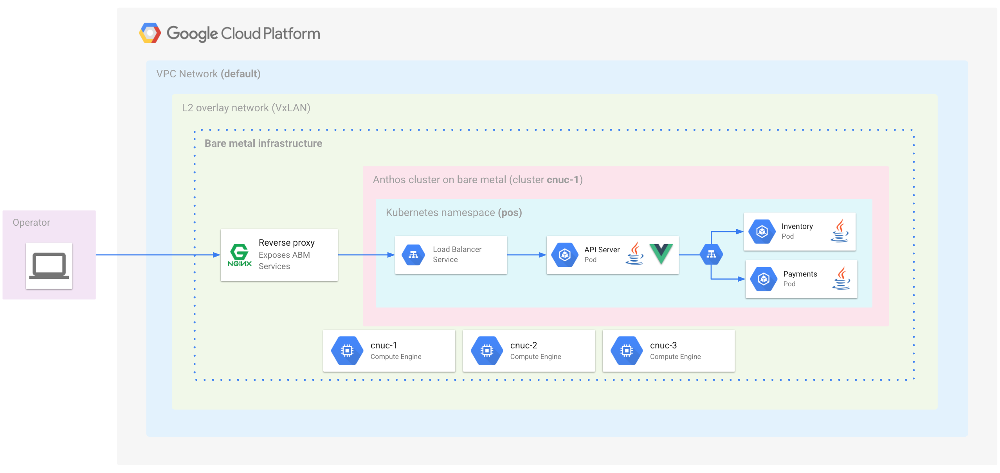
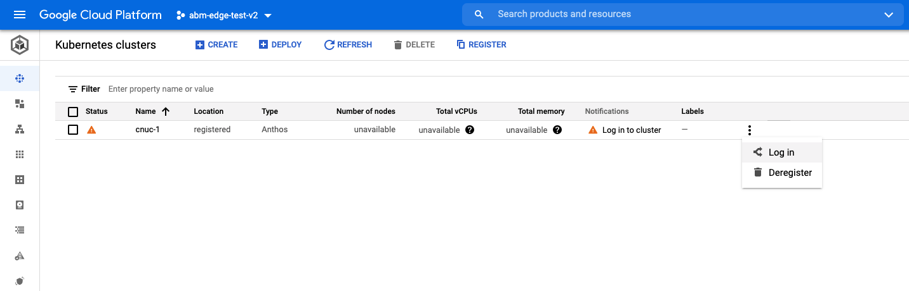
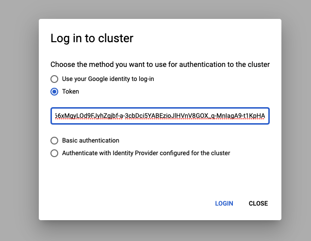
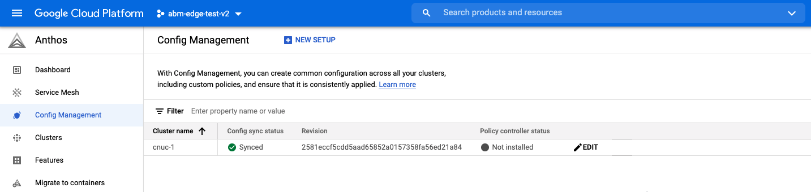
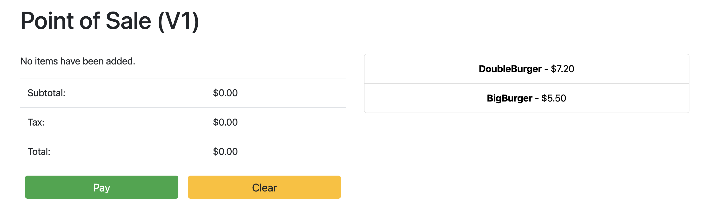
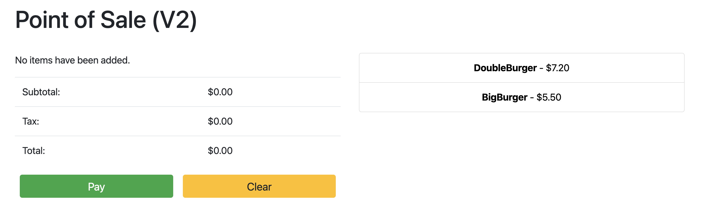

# Overview

The resources here include an advanced, ready-to-use solution _(for platform
operators and developers)_ that uses [Anthos on Bare Metal (ABM)](https://cloud.google.com/anthos/clusters/docs/bare-metal/1.8/concepts/about-bare-metal) and [Anthos Config Management (ACM)](https://cloud.google.com/anthos-config-management/docs/overview) to deploy Kubernetes clusters on the
edge at scale. We assume that you're familiar with the challenges of edge
deployments, the `gcloud` and `kubectl` command-line interfaces, [Ansible](https://www.ansible.com/)
playbooks and working with projects in Google Cloud. For a more detailed
description of this solution, see [Rolling out clusters on the edge at scale with Anthos for Bare Metal](https://cloud.google.com/bare-metal/docs/tutorials/abm-edge-at-scale).

In the quick start guide that follows we _emulate_ nodes in an edge location
using **Google Compute Engine (GCE)** VMs and walkthrough a use-case for
installing **Anthos on Bare Metal (ABM)** in that edge location. The
installation process also installs **Anthos Config Management (ACM)** in the
Anthos on Bare Metal clusters. We then show how a [**Point-Of-Sales** application](https://github.com/GoogleCloudPlatform/point-of-sale)
is automatically deployed to this edge location by _syncing_ with the [configurations](acm-config-sink/)
found in this repository using **ACM**. Finally, we experiment by updating the
configurations in this repository to see the changes being adopted on the edge
dynamically.

You can use the scripts to replicate this deployment on your own and then
customize it for your own requirements. A detailed description of these steps
_(including instructions for installing in an [Intel NUC](https://www.intel.com/content/www/us/en/products/details/nuc.html))_ can be found in the [detailed readme](README_DETAILED.md).

<p align="center">
  
  <em>
    <b>This diagram shows the deployement state at the end of this guide</b>
    </br>
    (click image to enlarge)
  </em>
</p>

### Prerequisites

- Make sure you have the following already installed in your workstation
  - **[Python](https://www.python.org/)** [>=2.7]
  - The following Python modules _(you can use the equivalent of `pip2` for `Python3`)_
    - **ansible** _(install with `pip2 install ansible`)_
    - **dnspython** _(install with `pip2 install dnspython`)_
    - **requests** _(install with `pip2 install requests`)_
    - **google-auth** _(install with `pip2 install google-auth`)_
  - **[Ansible CLI tool](https://docs.ansible.com/ansible/latest/installation_guide/intro_installation.html)**
  - **[Google Cloud SDK](https://cloud.google.com/sdk/docs/install#linux)** (aka: gcloud)
  - **envsubst** CLI tool _(usually already installed in *nix based OSes)_
  - **[skaffold](https://skaffold.dev/docs/install/)** [>=1.30.0] _(Optional)_
  - **[maven](https://maven.apache.org/install.html)** [>=3.6.3] _(Optional)_
  - **[Java](https://www.oracle.com/java/technologies/downloads/#java11)** [11.*] _(Optional)_

> _**Note:** The prerequisites marked as _(Optional)_ are only required if you
> want to modify the source for the [Point-Of-Sales](https://github.com/GoogleCloudPlatform/point-of-sale)
> application. It is not required for just trying this Quick start._
---

## Quick start

The following quick start guide will take approximately **55-60 minutes** to complete if you have the _prerequisites_ already setup.
### 1. Setup Google Cloud Environment
#### 1.1) Make a copy of this repository into any `git` based version control system you use _(e.g. GitHub, GitLab, Bitbucket etc.)_

> **Note:** If you want to continue with GitHub, see [forking a repository](https://docs.github.com/en/get-started/quickstart/fork-a-repo#forking-a-repository) for creating
> your own copy of this repository in GitHub.

```sh
# once you have forked this repository, clone it to your local machine
git clone https://github.com/<YOUR_GITHUB_USERNAME>/anthos-samples

# move into the root of the infrastructure setup directory
cd anthos-samples/anthos-bm-edge-deployment
```


#### 1.2) Setup environment variables _(example values are set for some variables; you can change them if you want to name them something else)_
```sh
export PROJECT_ID="<YOUR_GCP_PROJECT_ID>"
export REGION="us-central1"
export ZONE="us-central1-a"

# path to which the Google Service Account key file will be downloaded to
export LOCAL_GSA_FILE="$(pwd)/remote-gsa-key.json"

# port on the GCE instance we will use to setup the nginx proxy to allow traffic into the AnthosBareMetal cluster
export PROXY_PORT="8082"

# should be a multiple of 3 since N/3 clusters are created with each having 3 nodes
export MACHINE_COUNT="3"

# fork of this repository: https://github.com/GoogleCloudPlatform/anthos-samples
export ROOT_REPO_URL="<LINK_TO_YOUR_FORK_OF_THIS_REPO>"

# this is the username used to authenticate to your fork of this repository
export SCM_TOKEN_USER="<YOUR_GIT_VERSION_CONTROL_USERNAME>"

# this is the access token that will be used to authenticate against your fork of this repository
export SCM_TOKEN_TOKEN="<ACCESS_TOKEN_FOR_YOUR_GIT_REPO>"
```

> **Note:** If you are trying this out with GitHub as your git version control and have forked this repository into your GitHub account then:
> - Used the link to your forked GitHub repository for `ROOT_REPO_URL`
> - Use your GitHub username for `SCM_TOKEN_USER`
> - Use [this link](https://docs.github.com/en/github/authenticating-to-github/keeping-your-account-and-data-secure/creating-a-personal-access-token) to create a personal access token and use that for `SCM_TOKEN_TOKEN`
>   - Under the **"Select scopes"** section for creating a token _only_ select the **"public_repo"** scope

#### 1.3) Choose and configure the Google Cloud Project, Region and Zone you would like to use

> **Note:** _This step can take upto ***90 seconds*** to complete_

```sh
gcloud config set project "${PROJECT_ID}"
gcloud services enable compute.googleapis.com

gcloud config set compute/region "${REGION}"
gcloud config set compute/zone "${ZONE}"
```

#### 1.4) Setup up GCP Service Account used by the GCE instances
```sh
# when asked "Create a new key for GSA? [y/N]" type "y" and press
./scripts/create-primary-gsa.sh
```
---

### 2. Provision the GCE instances
#### 2.1) Configure SSH keys and create the GCE instances where Anthos BareMetal will be installed

> **Note:** _This step can take upto ***2 minutes*** to complete for a setup with $MACHINE_COUNT=3_

```sh
# just press the return key when asked for a passphrase for the SSH key (i.e. empty string)
./scripts/cloud/easy-install.sh
```
> **Note:** This script updates your `/etc/hosts` file with the IP addresses of
> the created GCE VMs. Thus, it will prompt you to provide the **password** to
> your local workstation

#### 2.2) Test SSH connectivity to the GCE instances
```sh
# If the checks fail the first time with errors like "sh: connect to host cnuc-1 port 22: Connection refused"
# then wait a few seconds and retry
for i in `seq $MACHINE_COUNT`; do
  HOSTNAME="cnuc-$i"
  ssh abm-admin@${HOSTNAME} 'ping -c 3 google.com'
done
```
```sh
# -----------------------------------------------------#
#                   Expected Output                    #
# -----------------------------------------------------#
PING google.com (74.125.124.113) 56(84) bytes of data.
64 bytes from jp-in-f113.1e100.net (74.125.124.113): icmp_seq=1 ttl=115 time=1.10 ms
64 bytes from jp-in-f113.1e100.net (74.125.124.113): icmp_seq=2 ttl=115 time=1.10 ms
64 bytes from jp-in-f113.1e100.net (74.125.124.113): icmp_seq=3 ttl=115 time=0.886 ms

--- google.com ping statistics ---
3 packets transmitted, 3 received, 0% packet loss, time 2003ms
rtt min/avg/max/mdev = 0.886/1.028/1.102/0.100 ms
PING google.com (108.177.112.139) 56(84) bytes of data.
...
...
...
```
---

### 3. Install Anthos BareMetal with ansible
#### 3.1) Generate Ansible inventory file from template and verify setup
```sh
envsubst < templates/inventory-cloud-example.yaml > inventory/gcp.yaml
./scripts/verify-pre-installation.sh
./scripts/health-check.sh
```
```sh
# -----------------------------------------------------#
#                   Expected Output                    #
# -----------------------------------------------------#
cnuc-1 | SUCCESS => {"ansible_facts": {"discovered_interpreter_python": "/usr/bin/python3"},"changed": false,"ping": "pong"}
cnuc-2 | SUCCESS => {"ansible_facts": {"discovered_interpreter_python": "/usr/bin/python3"},"changed": false,"ping": "pong"}
cnuc-3 | SUCCESS => {"ansible_facts": {"discovered_interpreter_python": "/usr/bin/python3"},"changed": false,"ping": "pong"}


SUCCESS!!

Proceed!!
```

#### 3.2) Run the Ansible playbook for installing Anthos Bare Metal on the GCE instances

> **Note:** _This step can take upto **35 minutes** to complete for a setup with $MACHINE_COUNT=3_
> - ***Pre-install configuration of the GCE instances:*** ~10 minutes</br>
> - ***Installing Anthos BareMetal:*** ~20 minutes</br>
> - ***Post-install configuration of the GCE instances:*** ~5 minutes

```sh
# this will configure the GCE instances with all the necessary tools, install Anthos BareMetal, install Anthos
# Config Management and configure it to sync with the configs at $ROOT_REPO_URL/anthos-bm-edge-deployment/acm-config-sink
ansible-playbook -i inventory cloud-full-install.yaml
```
```sh
# -----------------------------------------------------#
#                   Expected Output                    #
# -----------------------------------------------------#
...
...
PLAY RECAP ********************************************************************************************************
cnuc-1                     : ok=136  changed=106  unreachable=0    failed=0    skipped=33   rescued=0    ignored=8
cnuc-2                     : ok=86   changed=67   unreachable=0    failed=0    skipped=71   rescued=0    ignored=2
cnuc-3                     : ok=86   changed=67   unreachable=0    failed=0    skipped=71   rescued=0    ignored=2
```
---
### 4. Log in to the ABM kubernetes cluster in the Google Cloud console
#### 4.1) Copy the utility script into the admin GCE instance and generate a token
```sh
# Copy the utility scripts into the admin node of the cluster
scp -i ~/.ssh/cnucs-cloud scripts/cloud/cnuc-k8s-login-setup.sh abm-admin@cnuc-1:

# SSH into the admin node of the cluster
ssh -i ~/.ssh/cnucs-cloud abm-admin@cnuc-1

# execute the script and copy token that is printed out
./cnuc-k8s-login-setup.sh
```
```sh
# -----------------------------------------------------#
#                   Expected Output                    #
# -----------------------------------------------------#
...
...
# Retrieving Kubernetes Service Account Token

🚀 ------------------------------TOKEN-------------------------------- 🚀
eyJhbGciOiJSUzI1NiIsImtpZCI6Imk2X3duZ3BzckQyWmszb09sZHFMN0FoWU9mV1kzOWNGZzMyb0x2WlMyalkifQ.eyJpc3MiOiJrdW
mljZS1hY2NvdW50LnVpZCI6IjQwYWQxNDk2LWM2MzEtNDhiNi05YmUxLWY5YzgwODJjYzgzOSIsInN1YiI6InN5c3RlbTpzZXJ2aWNlYW
iZXJuZXRlcy5pby9zZXJ2aWNlYWNjb3VudC9zZWNyZXQubmFtZSI6ImVkZ2Etc2EtdG9rZW4tc2R4MmQiLCJrdWJlcm5ldGVzLmlvL3Nl
cnZpY2VhY2NvdW50L3NlcnZpY2UtYWNjb3VudC5uYW1lIjoiZWRnYS1zYSIsImt1YmVybmV0ZXMuaW8vc2VydmljZWFjY291bnQvc2Vyd
4CwanGlof6s-fbu8IUy1_bTgCminylNKb3VudC5uYW1lIjoiZWRnYS1zYSIsImt1YmVybmV0ZXuaP-hDEKURb5O6IxulTXWH6dxYxg66x
Njb3VudDpkZWZhdWx0OmVkZ2Etc2EifQ.IXqXwX5pg9RIyNHJZTM6cBKTEWOMfQ4IQQa398f0qwuYlSe12CA1l6P8TInf0S1aood7NJWx
xe-5ojRvcG8pdOuINq2yHyQ5hM7K7R4h2qRwUznRwuzOp_eXC0z0Yg7VVXCkaqnUR1_NzK7qSu4LJcuLzkCYkFdSnvKIQABHSvfvZMrJP
Jlcm5ldGVzL3NlcnZpY2VhY2NvdW50Iiwia3ViZXJuZXRlcy5pby9zZXJ2aWNlYWNjb3VudC9uYW1lc3BhY2UiOiJkZWZhdWx0Iiwia3V
MgyLOd9FJyhZgjbf-a-3cbDci5YABEzioJlHVnV8GOX_q-MnIagA9-t1KpHA
🚀 ------------------------------------------------------------------- 🚀
```

Once you have run the above steps, copy the `Token` that is printed out and login
to the kubernetes cluster from the [`Kubernetes clusters`](https://console.cloud.google.com/kubernetes/list/overview) page in the Google Cloud
console.

<p align="center">
  
  <em>(click image to enlarge)</em>
  </br>
  </br>
  
</p>

Verify that the cluster has `synced` with the [configurations from this repository](/acm-config-sink)
using [**Anthos Config Management**](https://console.cloud.google.com/anthos/config_management)
<p align="center">
  
  <em>(click image to enlarge)</em>
</p>

---
### 5. Configure the reverse proxy to route external traffic to ABM's bundled Metal load balancer
#### 5.1)  Setup the `nginx` configuration to route traffic to the `API Server Load Balancer` service

> **Note:** _The following commands are run inside the admin GCE instance (**cnuc-1**). You must already be SSH'ed into it from the previous steps_

```sh
# get the IP address of the LoadBalancer type kubernetes service
ABM_INTERNAL_IP=$(kubectl get services api-server-lb -n pos | awk '{print $4}' | tail -n 1)

# update the template configuration file with the fetched IP address
sudo sh -c "sed 's/<K8_LB_IP>/${ABM_INTERNAL_IP}/g' /etc/nginx/nginx.conf.template > /etc/nginx/nginx.conf"

# restart nginx to ensure the new configuration is picked up
sudo systemctl restart nginx

# check and verify the status of the nginx server to be "active (running)"
sudo systemctl status nginx
```
```sh
# -----------------------------------------------------#
#                   Expected Output                    #
# -----------------------------------------------------#
● nginx.service - A high performance web server and a reverse proxy server
     Loaded: loaded (/lib/systemd/system/nginx.service; enabled; vendor preset: enabled)
     Active: active (running) since Fri 2021-09-17 02:41:01 UTC; 2s ago
       Docs: man:nginx(8)
    Process: 92571 ExecStartPre=/usr/sbin/nginx -t -q -g daemon on; master_process on; (code=exited, status=0/SUCCESS)
    Process: 92572 ExecStart=/usr/sbin/nginx -g daemon on; master_process on; (code=exited, status=0/SUCCESS)
   Main PID: 92573 (nginx)
      Tasks: 17 (limit: 72331)
     Memory: 13.2M
     CGroup: /system.slice/nginx.service
             ├─92573 nginx: master process /usr/sbin/nginx -g daemon on; master_process on;
             ├─92574 nginx: worker process
             ├─92575 nginx: worker process
             ├─92576 nginx: worker process
             ├─92577 nginx: worker process
             ├─92578 nginx: worker process
             ├─92579 nginx: worker process
             ├─92580 nginx: worker process
             ├─92581 nginx: worker process
```

```sh
# exit out of the admin instance
exit
```
---

### 6. Access the Point of Sale application
#### 6.1) Get the external IP address of the admin GCE instance and access the UI of the **Point of Sales** application

> **Note:** _The following commands are run in your local workstations. If you are still inside the admin GCE instance via SSH, then type **exit** to end the SSH session_

```sh
EXTERNAL_IP=$(gcloud compute instances list --project ${PROJECT_ID} --filter="name:cnuc-1" --format="get(networkInterfaces[0].accessConfigs[0].natIP)")
echo "Point the browser to: ${EXTERNAL_IP}:${PROXY_PORT}"
```
```sh
# -----------------------------------------------------#
#                   Expected Output                    #
# -----------------------------------------------------#
Point the browser to: 34.134.194.84:8082
```
<p align="center">
  
</p>

---
### 7. Update the API-Server version and observe the change

#### 7.1) Update the **image tag** for the [api-server service](acm-config-sink/namespaces/pos/api-server.yaml#L33) to `v2` from `v1` and push the change to the upstream repository

```yaml
# portion of interest in the api-server.yaml file is shown here
apiVersion: apps/v1
kind: Deployment
metadata:
  name: api-server
spec:
  selector:
  template:
    spec:
      # [START anthosbaremetal_pos_deployment_api_server]
      - name: api-server
        image: us-docker.pkg.dev/anthos-dpe-abm-edge-pos/abm-edge-pos-images/api-server:v1
      # [END anthosbaremetal_pos_deployment_api_server]
```

```sh
# push the change
git add acm-config-sink/namespaces/pos/api-server.yaml
git commit -m "chore: updated api-server version to v2"
git push
```

#### 7.2) Reload the application to view the changes

First, check if the latest commit has been synched in the [Anthos Config Management page](https://console.cloud.google.com/anthos/config_management) _(similar to the ACM image in step [**4.1**](#41-copy-the-utility-script-into-the-admin-gce-instance-and-generate-a-token))_. Then, wait for the `Pod` to be updated _(you can monitor it in the console)_. Once the status of the `Pod` changes to `Running`, point your browser to the same url as earlier. This time you should see that the `v2` version of the application has been deployed!

<p align="center">
  
</p>

> **Note:** You might have to do a [hard refresh](https://www.namecheap.com/support/knowledgebase/article.aspx/10078/2194/how-to-do-a-hard-refresh-in-chrome-firefox-and-ie/) for the browser to reload the new content.
---
### Clean up

#### Google Cloud
  - If you used a fresh Google Cloud Project, then you can simply delete it
  - If you used an existing Google Cloud Project, then you have to delete the
    following resources:
    * All [Kubernetes clusters](https://console.cloud.google.com/kubernetes/list/overview) with a name prefixed by **"cnuc-"**
    * All [Compute Engine VMs](https://console.cloud.google.com/compute/instances) with a name prefixed by **"cnuc-"**
    * The [Cloud Storage](https://console.cloud.google.com/storage) bucket with a name prefixed by **"abm-edge-boot"**
    * The [Firewall Rules](https://console.cloud.google.com/networking/firewalls/list) `allow-pod-ingress` and `allow-pod-egress`
    * The [Secrets Manager](https://console.cloud.google.com/security/secret-manager?project=abm-edge-test) secret `install-pub-key`

#### Local workstation
- In addition, you might also want to cleanup the following changes made in your local workstation:
  * Remove the GCE VM IP addresses added to the `/etc/hosts` file
  * Remove the SSH configuration for `cnuc-*` in the `~/.ssh/config` file
  * Remove the GCE VM fingerprints from the `~/.ssh/known_hosts` file
