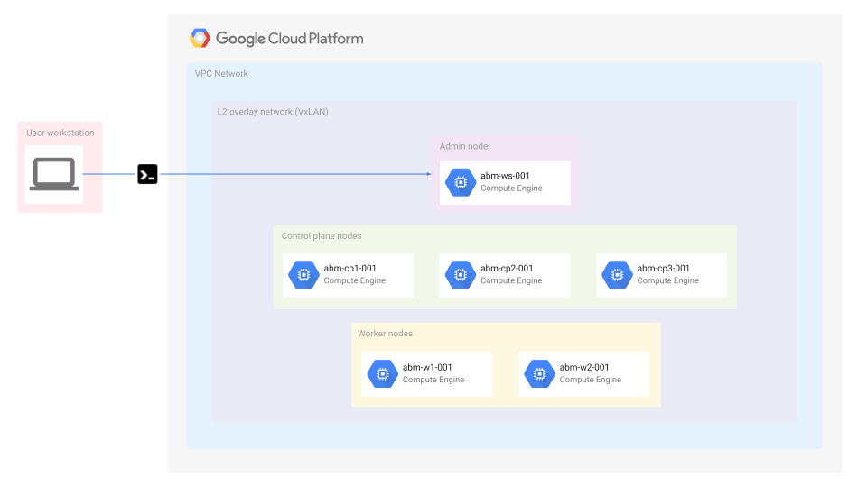

## Anthos Baremetal on Google Compute Engine VMs with Terraform

This repository shows you how to use Terraform to try Anthos clusters on bare metal in High Availability (HA) mode using Virtual Machines (VMs) running on Compute Engine. For information about how to use the `gcloud` command-line tool to try this, see [Try Anthos clusters on bare metal on Compute Engine VMs](https://cloud.google.com/anthos/clusters/docs/bare-metal/1.6/try/gce-vms).

### Pre-requisites

- A workstation with access to internet _(i.e. Google Cloud APIs)_ with the following installed
  - [Git](https://www.atlassian.com/git/tutorials/install-git)
  - [Google Cloud SDK](https://cloud.google.com/sdk/docs/install)
  - [Terraform](https://learn.hashicorp.com/tutorials/terraform/install-cli) (~v0.14.10)
- A [GCP Project](https://console.cloud.google.com/cloud-resource-manager?_ga=2.187862184.1029435410.1614837439-1338907320.1614299892) _(in which the resources for the setup will be provisioned)_ with the following setup
  - The project added to a [monitoring workspace](https://console.cloud.google.com/monitoring?_ga=2.256070603.1395081395.1617860495-190605143.1617846491). _You can create a new workspace for the project or associate it to an existing one._
  - A [Service Account](https://cloud.devsite.corp.google.com/iam/docs/creating-managing-service-accounts) in the project with either `Project Editor` or `Project Owner` permissions and its **[key file downloaded to the workstation](https://cloud.devsite.corp.google.com/iam/docs/creating-managing-service-account-keys)**
---
### Bare metal infrastructure on Google Cloud using Compute Engine VMs
</br>

The [Quick starter](#quick-starter) that follows sets up the following infrastructure in Google Cloud using Compute Engine VMs.



---
### Quick starter

1. Clone this repo into the workstation from where the rest of this guide will be followed

2. Update the `terraform.tfvars.sample` file to include variables specific to your environment
```
project_id       = "<GOOGLE_CLOUD_PROJECT_ID>"
region           = "<GOOGLE_CLOUD_REGION_TO_USE>"
zone             = "<GOOGLE_CLOUD_ZONE_TO_USE>"
credentials_file = "<PATH_TO_GOOGLE_CLOUD_SERVICE_ACCOUNT_FILE>"
```

3. Rename the `variables` file to default name used by terraform
> **Note:** You can skip this step if you run `terraform apply` with the `-var-file` flag
```sh
> mv terraform.tfvars.sample terraform.tfvars
```

4. Navigate to the root directory of this repository initialize it as a _terraform_ directory
```sh
> # similar to 'git init'; sets up the required terraform state management configurations
> terraform init
```

5. Create a _terraform_ execution plan
```sh
> # compares the state of the resources, verifies the scripts and creates an execution plan
> terraform plan
```

6. Apply the changes described in the _terraform_ script
```sh
> # executes the plan on the given provider (i.e: GCP) to reach the desired state of resources
> terraform apply
```
> **Note:** Once prompted to confirm the terraform plan, type `Yes` and enter

***The above should initiate terraform to start setting up the GCE hosts for the baremetal cluster. This may take a few minutes (approx. 3-5 mins) for the entire bare-metal cluster to be setup.***

5. Once the previous step completes you should see a printed output as follows for the next steps to follow. Just copy/paste the commands and run them.
> **Note:** If the `bmctl` command fails, it could be because the admin host hasn't completed its setup. Give it a few seconds and retry.

```sh
################################################################################
##              AnthosBM on Google Compute Engine VM with Terraform           ##
##                        (Run the following commands)                        ##
##   (Note that the 1st command should have you SSH'ed into the admin host)   ##
################################################################################

> gcloud compute ssh tfadmin@abm-ws-001 --project=shabir-abm-local --zone=us-central1-a

# ------------------------------------------------------------------------------
# You must be SSH'ed into the admin host abm-ws-001 as tfadmin user now
# ------------------------------------------------------------------------------
> sudo bmctl create config -c anthos-gce-cluster && \
  sudo cp ~/anthos-gce-cluster.yaml bmctl-workspace/anthos-gce-cluster && \
  sudo bmctl create cluster -c anthos-gce-cluster

################################################################################
```
***The above should setup the baremetal cluster. This includes doing preflight checks on the nodes, creating the admin and user clusters and also registering the cluster with Google Cloud using [Connect](https://cloud.google.com/anthos/multicluster-management/connect/overview). The whole setup may take upto approx. 15 minutes***

You will see the following output as the ***admin cluster*** is being created
```sh
Created config: bmctl-workspace/anthos-gce-cluster/anthos-gce-cluster.yaml
Creating bootstrap cluster... OK
Installing dependency components... OK
Waiting for preflight check job to finish... OK
- Validation Category: machines and network
        - [PASSED] 10.200.0.3
        - [PASSED] 10.200.0.4
        - [PASSED] 10.200.0.5
        - [PASSED] 10.200.0.6
        - [PASSED] 10.200.0.7
        - [PASSED] gcp
        - [PASSED] node-network
Flushing logs... OK
Applying resources for new cluster
Waiting for cluster to become ready OK
Writing kubeconfig file
kubeconfig of created cluster is at bmctl-workspace/anthos-gce-cluster/anthos-gce-cluster-kubeconfig, please run
kubectl --kubeconfig bmctl-workspace/anthos-gce-cluster/anthos-gce-cluster-kubeconfig get nodes
to get cluster node status.
Please restrict access to this file as it contains authentication credentials of your cluster.
Waiting for node pools to become ready OK
Moving admin cluster resources to the created admin cluster
Flushing logs... OK
Deleting bootstrap cluster... OK
```

---
### Verify and interacting with the Baremetal cluster

You can find your cluster's `kubeconfig` file on the admin machine in the `bmctl-workspace` directory. To verify your deployment, complete the following steps

1. SSH into the admin workstation _(if you are not already inside it)_:
```sh
> # You can copy the command from the output of terraform run from the previous step
> gcloud compute ssh root@abm-ws-001 --project=<YOUR_PROJECT> --zone=<YOUR_ZONE>
```

2. Set the `KUBECONFIG` environment variable with the path to the cluster's configuration file to run `kubectl` commands on the cluster.
```sh
> export CLUSTER_ID=anthos-gce-cluster
> export KUBECONFIG=$HOME/bmctl-workspace/$CLUSTER_ID/$CLUSTER_ID-kubeconfig
> kubectl get nodes
```

You should see the nodes of the cluster printed, _similar_ to the output below:
```sh
NAME          STATUS   ROLES    AGE   VERSION
abm-cp1-001   Ready    master   17m   v1.18.6-gke.6600
abm-cp2-001   Ready    master   16m   v1.18.6-gke.6600
abm-cp3-001   Ready    master   16m   v1.18.6-gke.6600
abm-w1-001    Ready    <none>   14m   v1.18.6-gke.6600
abm-w2-001    Ready    <none>   14m   v1.18.6-gke.6600
```

#### Interacting with the cluster via the GCP console

During the setup process, your cluster will be auto-registered in Google Cloud using [Connect](https://cloud.google.com/anthos/multicluster-management/connect/overview). In order to interact with the cluster from the GCP console you must first ***login*** to the cluster.

The [Logging in to a cluster from the Cloud Console](https://cloud.google.com/anthos/multicluster-management/console/logging-in/) guide describes how this can be done.

---
### Cleanup

You can cleanup the cluster setup in two ways,

#### Using terraform
```sh
> # to be run from the root directory of this repo
> terraform destroy
```

#### Deleting the GCP project
- Directly delete the project from the console
