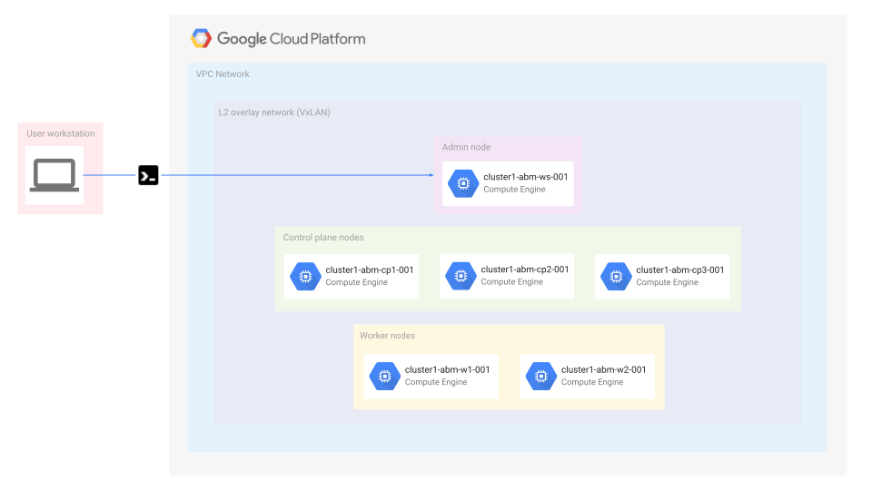

## Anthos Baremetal on Google Compute Engine VMs with Terraform

This repository shows you how to use Terraform to try Anthos clusters on bare metal in High Availability (HA) mode using Virtual Machines (VMs) running on Compute Engine. For information about how to use the `gcloud` command-line tool to try this, see [Try Anthos clusters on bare metal on Compute Engine VMs](https://cloud.google.com/anthos/clusters/docs/bare-metal/latest/try/gce-vms).

### Pre-requisites

- A workstation with access to internet _(i.e. Google Cloud APIs)_ with the following installed
  - [Git](https://www.atlassian.com/git/tutorials/install-git)
  - [Google Cloud SDK](https://cloud.google.com/sdk/docs/install)
  - [Terraform](https://learn.hashicorp.com/tutorials/terraform/install-cli) (>= v0.15.5, < 1.4)

- A [Google Cloud Project](https://console.cloud.google.com/cloud-resource-manager?_ga=2.187862184.1029435410.1614837439-1338907320.1614299892) _(in which the resources for the setup will be provisioned)_

- A [Service Account](https://cloud.google.com/iam/docs/creating-managing-service-accounts) in the project that satisfies **one** of the following requirements and its **[key file downloaded](docs/create_sa_key.md)** to the workstation:
  - The Service Account has `Owner` permissions
  - The Service Account has both `Editor` and `Project IAM Admin` permissions

---
### Bare metal infrastructure on Google Cloud using Compute Engine VMs

The [Quick starter](docs/quickstart.md) guide sets up the following infrastructure in Google Cloud using Compute Engine VMs. The diagram assumes that the none of the default values for the [variables](variables.tf) were changed other than the ones mentioned in the quick starter.



---
## Getting started

- [Terraform Module Information _(includes variables definitions)_](docs/variables.md)

- [Quick start guide](docs/quickstart.md):
    - The terraform script sets up the GCE VM environment. The output of the script prints out the commands to follow to install **Anthos on bare metal** in the provisioned GCE VMs.

- [All in one install](docs/one_click_install.md):
    - The terraform script sets up the GCE VM environment and also triggers the **Anthos on bare metal** installation on the provisioned GCE VMs. The output of the script prints out the commands to SSH into the *admin workstation VM* and monitor the Anthos on bare metal installation process.

- [Manual LB install](docs/manuallb_install.md):
    - The terraform script sets up the GCE environment and triggers the **Anthos on bare metal** installation similar to the [all-in-one install](docs/one_click_install.md). However, in this mode **Anthos on bare metal** is installed with a [`Manual Loadbalancer`](https://cloud.google.com/anthos/clusters/docs/bare-metal/latest/installing/manual-lb) instead of the default [`Bundled LB`](https://cloud.google.com/anthos/clusters/docs/bare-metal/latest/installing/bundled-lb). We use [Google Cloud Loadbalancer](https://cloud.google.com/load-balancing/docs/load-balancing-overview) as the manual loadbalancer for the Anthos on bare metal cluster. The output of the script prints out the same instructions as the all-in-one install; additionally it also prints out the **Public IP** addresses of the loadbalancers.

- [NFS Shared Storage](docs/nfs.md):
    - An optional NFS server is provisioned in conjunction with any of the install methods above to provide shared storage to the **Anthos on bare metal** cluster.

---
## Contributing

#### Pre-requisites
- The same [pre-requisites](#pre-requisites) to run this sample is required for testing as well

#### Pull requests
- For improvements to this sample submit your pull requests to the `main` branch

#### Testing
- Ensure that the improvements have _unit/integration tests_ where appropriate
- To run the existing tests you have to set two environment variables
```bash
export GOOGLE_CLOUD_PROJECT="<YOUR_GOOGLE_CLOUD_PROJECT>"
export GOOGLE_APPLICATION_CREDENTIALS="<PATH_TO_THE_SERVICE_ACCOUNT_KEY_FILE>"
```
- Move into the test directory and recursively execute the tests
```bash
cd anthos-bm-gcp-terraform/test
go test -v -timeout 30m ./...
```
