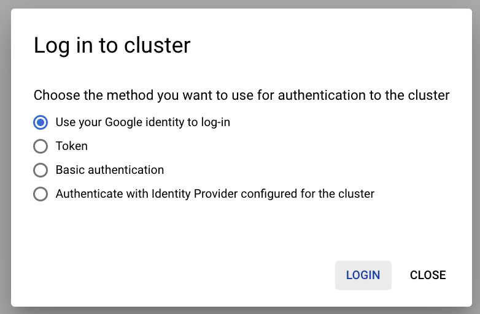

## Logging into the Anthos bare metal cluster

Upon successful installation the Anthos bare metal cluster would be already **registered**
in Google Cloud. By **logging in** to the registered cluster, you can view and interact with
cluster resources _(like Pods, Services etc)_ via the Google Cloud Platform (GCP) UI.

<p align="center">
  
  <em>
    <b>Example of a cluster registered with Anthos but not logged in</b>
    </br>
    (click image to enlarge)
  </em>
</p>

The [Logging in to a cluster from the Cloud Console](https://cloud.google.com/anthos/multicluster-management/console/logging-in/) guide describes various ways in which you can login to a
registered cluster in GCP. Here, we explain two of those login approaches:
  - [Login with Kubernetes Service Account Token](#login-with-kubernetes-service-account-token)
  - [Login with Google Cloud Identity](#login-with-google-cloud-identity)
---
### Login with Kubernetes Service Account Token

Once you have completed the Anthos on bare metal installation by following either
the [quickstart](quickstart.md) or [all in one install](one_click_install.md) guide,
the terraform scripts would have copied the [login.sh](/anthos-bm-gcp-terraform/resources/login.sh) script into the _admin workstation VM_. You can simply run that script to generate a
**Kubernetes Service Account Token**.

1. SSH into the admin workstation VM
```sh
gcloud compute ssh tfadmin@cluster1-abm-ws0-001 --project=<YOUR_PROJECT> --zone=<YOUR_ZONE>
```

2. Ensure that the `KUBECONFIG` environment variable is set
```sh
export KUBECONFIG=$HOME/bmctl-workspace/$CLUSTER_ID/$CLUSTER_ID-kubeconfig
```

3. Execute the `login.sh` script
```sh
/home/tfadmin/login.sh
```

This will print the generated **Token**:
```sh
...
💡 Retreiving Kubernetes Service Account Token

🚀 ------------------------------TOKEN-------------------------------- 🚀
eyJhbGciOiJSUzI1NiIsImtpZCI6Im16T1o5SE1BUTF0S2lOZk9fSEdiVUx1VEdtRmFTRV9xb0s2TmZ0WVFQQ3MifQ.
eyJpc3MiOiJrdWJlcm5ldGVzL3NlcnZpY2VhY2NvdW50Iiwia3ViZXJuZXRlcy5pby9zZXJ2aWNlYWNjb3VudC9uYW1
lc3BhY2UiOiJkZWZhdWx0Iiwia3ViZXJuZXRlcy5pby9zZXJ2aWNlYWNjb3VudC9zZWNyZXQubmFtZSI6ImVkZ2Etc2
EtdG9rZW4tbXpnbDIiLCJrdWJlcm5ldGVzLmlvL3NlcnZpY2VhY2NvdW50L3NlcnZpY2UtYWNjb3VudC5uYW1lIjoiZ
WRnYS1zYSIsImt1YmVybmV0ZXMuaW8vc2VydmljZWFjY291bnQvc2VydmljZS1hY2NvdW50LnVpZCI6IjJhMjI1MDIz
LTBmMTAtNDkxNS1iN2M5LTRkOTIwODIzYzZmOCIsInN1YiIt0ps71p-5Gn8ev3yTYFUwWXMAGVHEvc-93LuJDQQmfVE
E3DlQYgNa_cmPDKJ0eDSzvj777EUVLp8Y20jU5OC-aVVieSgz43vw-Vb1BZy2peffW_Vl566P_xIyc-0XNeuN0ic2G1
qBuDBO7sVBi-HQRWlAQROCHmDo1oRKKqFwED57zBx40ii7YgB11npxZrS729tOOG0cLIq_EQtu1QbTldjrEak02L9Bw
U4M8tqUrBlz-L84Q7ZG_MLYlgu6DZV_9cKvTGCWWlIuGB7df78Q07QY7xjMbqH5eQ4vcd05X0h5wGwbQGf3X2jUQ_zB
MTBFYeulqNpVFdTH69j_u43nQ
🚀 ------------------------------------------------------------------- 🚀
```

You can copy this token and use it to login via the Cloud Console.

<p align="center">
  
  <em>
    </br>
    (click image to enlarge)
  </em>
</p>

<p align="center">
  
  <em>
    </br>
    (click image to enlarge)
  </em>
</p>

<p align="center">
  
  <em>
    <b>Example of a cluster logged in via Cloud Console</b>
    </br>
    (click image to enlarge)
  </em>
</p>

---

### Login with Google Cloud Identity

Instead of creating a Kubernetes Service Account Token, you can use the email
identity associated with your Google Cloud Platform account to `Login` to the
cluster. There are two scenarios for using this method:

  - [Configure a new cluster for Google Cloud Identity Login](#configure-a-new-cluster-for-google-cloud-identity-login)
  - [Configure an existing cluster for Google Cloud Identity Login](#configure-an-existing-cluster-for-google-cloud-identity-login)

<p align="center">
  
  <em>
    </br>
    (click image to enlarge)
  </em>
</p>

---
#### Configure a new cluster for Google Cloud Identity Login
A new cluster can be configured to allow `Login` using GCP Accounts by
setting the `spec.clusterSecurity.authorization.clusterAdmin.gcpAccounts`
field in the cluster configuration. This field accepts a list of GCP Accounts
that must be allowed to `Login` to the cluster. Upon creation of the cluster
you should be able to `Login` using any of the provided GCP Accounts. If using
the Terraform script from this repository then you can simply set the
[`gcp_login_accounts`](/anthos-bm-gcp-terraform/variables.tf#L181) variable with
a list of GCP Accounts.

```sh
apiVersion: baremetal.cluster.gke.io/v1
kind: Cluster
metadata:
  name: cluster1
  namespace: cluster1-ns
spec:
  ...
  ...
  ...
  ...
  clusterSecurity:
    authorization:
      clusterAdmin:
        gcpAccounts: [foo@gmail.com, bar@gmail.com, bazz@google.com]
```
Once the cluster has been created, navigate to the clusters list page in Google
Cloud Console and select `Login` in the dropdown that appears by clicking the
verticle-ellipsis icon on the specific cluster's row. From the pop-up that
appears select `Use your Google identity to log-in` and click `Login`. This will
take you through the usual Google login flow. Use any of the GCP accounts you
included in the cluster configuration above to complete the flow. Upon
successful completion you will see a **green checkmark** next to the cluster to
indicate that you have logged in.

---
#### Configure an existing cluster for Google Cloud Identity Login

To configure an existing cluster to allow GCP Accounts for `Login` you must
first create Kubernetes `Roles` and `RoleBindings` against the GCP Accounts you
want to use. First make sure you are in the admin workstation and have the
`KUBECONFIG` environment variable pointing to the correct cluster's
configuration.

SSH into the admin workstation VM
```sh
gcloud compute ssh tfadmin@cluster1-abm-ws0-001 --project=<YOUR_PROJECT> --zone=<YOUR_ZONE>
```

Ensure that the `KUBECONFIG` environment variable is set
```sh
export KUBECONFIG=$HOME/bmctl-workspace/$CLUSTER_ID/$CLUSTER_ID-kubeconfig
```

Next, create the following `Roles` and `RoleBindings` for **each** GCP Account
you want to allow logging-in to the cluster.

```sh
export GCP_ACCOUNT=<YOU_GCP_ACCOUNT> # foo-bar@gmail.com
```
```sh
cat <<EOF > /tmp/impersonate.yaml
apiVersion: rbac.authorization.k8s.io/v1
kind: ClusterRole
metadata:
  name: gateway-impersonate
rules:
- apiGroups:
  - ""
  resourceNames:
  - ${GCP_ACCOUNT}
  resources:
  - users
  verbs:
  - impersonate
---
apiVersion: rbac.authorization.k8s.io/v1
kind: ClusterRoleBinding
metadata:
  name: gateway-impersonate
roleRef:
  kind: ClusterRole
  name: gateway-impersonate
  apiGroup: rbac.authorization.k8s.io
subjects:
- kind: ServiceAccount
  name: connect-agent-sa
  namespace: gke-connect
EOF
# Apply impersonation policy to the cluster.
kubectl apply -f /tmp/impersonate.yaml
```
```sh
cat <<EOF > /tmp/admin-permission.yaml
apiVersion: rbac.authorization.k8s.io/v1
kind: ClusterRoleBinding
metadata:
  name: gateway-cluster-admin
subjects:
- kind: User
  name: ${GCP_ACCOUNT}
roleRef:
  kind: ClusterRole
  name: cluster-admin
  apiGroup: rbac.authorization.k8s.io
EOF
# Apply permission policy to the cluster.
kubectl apply -f /tmp/admin-permission.yaml
```
Now you can `Login` to the cluster from the Google Cloud Console using
the `Use your Google identity to log-in` option. During the usual Google login
flow use the `GCP_ACCOUNT` you used above.