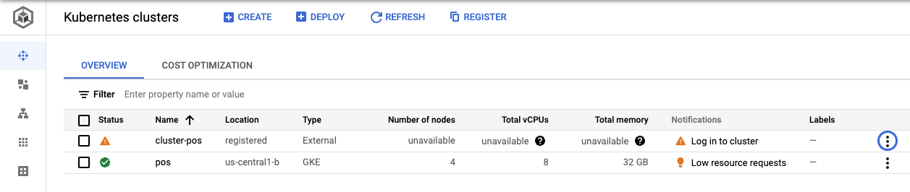
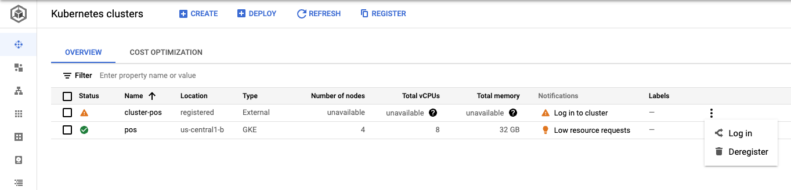
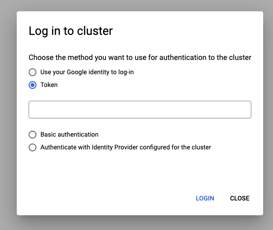
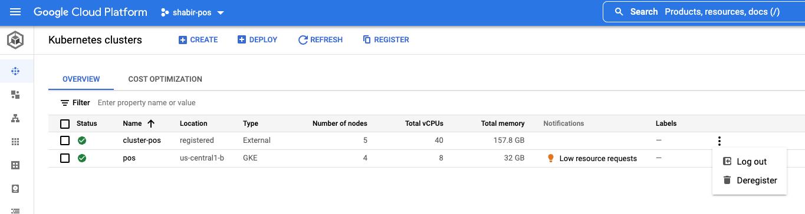

## Logging into the Anthos bare metal cluster

Upon successful installation the Anthos bare metal cluster would be already **registered**
in Google Cloud. By **logging in** to the registered cluster, you can view and interact with
cluster resources _(like Pods, Services etc)_ via the Google Cloud Platform (GCP) UI.

<p align="center">
  
  <em>
    <b>Example of a cluster registered with Anthos but not logged in</b>
    </br>
    (click image to enlarge)
  </em>
</p>

The [Logging in to a cluster from the Cloud Console](https://cloud.google.com/anthos/multicluster-management/console/logging-in/) guide describes various ways in which you
can login to a registered cluster in GCP. Here, we show how you can login by using a
**Kubernetes Service Account Token**.

Once you have completed the Anthos on bare metal installation by following either
the [quickstart](quickstart.md) or [all in one install](one_click_install.md) guide,
the terraform scripts would have copied the [login.sh](/anthos-bm-gcp-terraform/resources/login.sh) script into the _admin workstation VM_. You can simply run that script to generate a
**Kubernetes Service Account Token**.

1. SSH into the admin workstation VM
```sh
gcloud compute ssh tfadmin@cluster1-abm-ws0-001 --project=<YOUR_PROJECT> --zone=<YOUR_ZONE>
```

2. Ensure that the `KUBECONFIG` environment variable is set
```sh
export KUBECONFIG=$HOME/bmctl-workspace/$CLUSTER_ID/$CLUSTER_ID-kubeconfig
```

3. Execute the `login.sh` script
```sh
/home/tfadmin/login.sh
```

This will print the generated **Token**:
```sh
...
💡 Retreiving Kubernetes Service Account Token

🚀 ------------------------------TOKEN-------------------------------- 🚀
eyJhbGciOiJSUzI1NiIsImtpZCI6Im16T1o5SE1BUTF0S2lOZk9fSEdiVUx1VEdtRmFTRV9xb0s2TmZ0WVFQQ3MifQ.
eyJpc3MiOiJrdWJlcm5ldGVzL3NlcnZpY2VhY2NvdW50Iiwia3ViZXJuZXRlcy5pby9zZXJ2aWNlYWNjb3VudC9uYW1
lc3BhY2UiOiJkZWZhdWx0Iiwia3ViZXJuZXRlcy5pby9zZXJ2aWNlYWNjb3VudC9zZWNyZXQubmFtZSI6ImVkZ2Etc2
EtdG9rZW4tbXpnbDIiLCJrdWJlcm5ldGVzLmlvL3NlcnZpY2VhY2NvdW50L3NlcnZpY2UtYWNjb3VudC5uYW1lIjoiZ
WRnYS1zYSIsImt1YmVybmV0ZXMuaW8vc2VydmljZWFjY291bnQvc2VydmljZS1hY2NvdW50LnVpZCI6IjJhMjI1MDIz
LTBmMTAtNDkxNS1iN2M5LTRkOTIwODIzYzZmOCIsInN1YiIt0ps71p-5Gn8ev3yTYFUwWXMAGVHEvc-93LuJDQQmfVE
E3DlQYgNa_cmPDKJ0eDSzvj777EUVLp8Y20jU5OC-aVVieSgz43vw-Vb1BZy2peffW_Vl566P_xIyc-0XNeuN0ic2G1
qBuDBO7sVBi-HQRWlAQROCHmDo1oRKKqFwED57zBx40ii7YgB11npxZrS729tOOG0cLIq_EQtu1QbTldjrEak02L9Bw
U4M8tqUrBlz-L84Q7ZG_MLYlgu6DZV_9cKvTGCWWlIuGB7df78Q07QY7xjMbqH5eQ4vcd05X0h5wGwbQGf3X2jUQ_zB
MTBFYeulqNpVFdTH69j_u43nQ
🚀 ------------------------------------------------------------------- 🚀
```

You can copy this token and use it to login via the Cloud Console.

<p align="center">
  
  <em>
    </br>
    (click image to enlarge)
  </em>
</p>

<p align="center">
  
  <em>
    </br>
    (click image to enlarge)
  </em>
</p>

<p align="center">
  
  <em>
    <b>Example of a cluster logged in via Cloud Console</b>
    </br>
    (click image to enlarge)
  </em>
</p>
