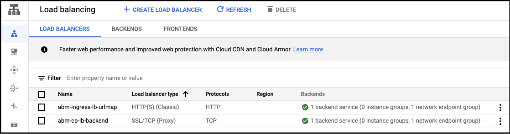
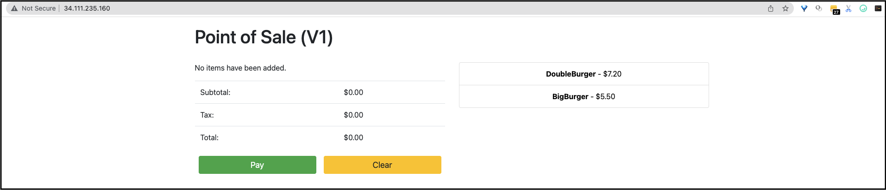

## Install with Manual Loadbalancer

This guide is an extension to the [all-in-one install guide](one_click_install.md).
The `all-in-one install` is a single run installation which automatically
triggers the complete **Anthos on bare metal** installation when the Terraform
script is run. The default installation sets up Anthos on bare metal to run
using a [bundled loadbalancer](https://cloud.google.com/anthos/clusters/docs/bare-metal/latest/installing/bundled-lb).
This means that the loadbalancer and the cluster services are reachable only
from inside one of the GCE VMs _(i.e. Admin workstation, Controlplane nodes, Worker nodes)_
created during the installation process.

While, this setup closely represents how **Anthos on bare metal (ABM)** will be
deployed in an actual enterprise baremetal environment, this is not ideal for
demos. With demo environments we would like to be able to easily reach the
`control plane` and the `ingress` of the Anthos on bare metal cluster without
having to SSH into a jump host.

Thus, this extension _(to the terraform script)_ installs Anthos on bare metal
using the [Manual LB](https://cloud.google.com/anthos/clusters/docs/bare-metal/latest/installing/manual-lb)
mode. We use [Google Cloud Loadbalancer](https://cloud.google.com/load-balancing/docs/load-balancing-overview)
as the loadbalancer fronting the Anthos on bare metal cluster.

---

### This new mode of installation creates **two** new Google Cloud Loadbalancers:
1. [TCP Loadbalancer](https://cloud.google.com/load-balancing/docs/ssl): this is
   the loadbalancer configured to front the `API Server (Controlplane)` of the
   ABM cluster. You can reach the `API Server` of your cluster via the
   `External IP Address` associated to this loadbalancer.
   
2. [HTTP(S) Loadbalancer](https://cloud.google.com/load-balancing/docs/https):
   this is the loadbalancer configured to front the `Ingress Service` of the ABM
   cluster. You can reach the `Kubernetes Services` of your cluster via the
   `External IP Address` associated to this loadbalancer.
 
<p align="center">
  
  <em>
    </br>
    (click image to enlarge)
  </em>
</p>

---

### Complete deployment architecture

<p align="center">
  
  <em>
    </br>
    (click image to enlarge)
  </em>
</p>

---

### Pre-requisites
- This guide has the [same pre-requisites as the quickstart guide](/anthos-bm-gcp-terraform/README.md#pre-requisites)

### Step by step guide

1. Clone this repo into the workstation from where the rest of this guide will be followed.
   Move into the directory of this sample.
```sh
cd anthos-bm-gcp-terraform/
```

2. Create a `terraform.tfvars` file from the sample input variables file
```sh
cp terraform.tfvars.sample terraform.tfvars
```

3. Update the `terraform.tfvars` file to include variables specific to your environment
```sh
# terraform.tfvars file

project_id       = "<GOOGLE_CLOUD_PROJECT_ID>"
region           = "<GOOGLE_CLOUD_REGION_TO_USE>"
zone             = "<GOOGLE_CLOUD_ZONE_TO_USE>"
credentials_file = "<PATH_TO_GOOGLE_CLOUD_SERVICE_ACCOUNT_FILE>"
```

4. Add the `mode` variable to the `terraform.tfvars` file

> **Note:** Alternative to changing the variables file you may run the following commands
> using the `-var 'mode=manuallb'` flag

```sh
# terraform.tfvars file
...
mode             = "manuallb"
...
```

5. Navigate to the root directory of this sample and initialize Terraform
```sh
terraform init
```

5. Create a _Terraform_ execution plan
```sh
terraform plan
```

6. Apply the changes described in the _Terraform_ script
```sh
terraform apply
```
> **Note:** When prompted to confirm the Terraform plan, type 'Yes' and enter

***The `apply` command sets up the Compute Engine VM based bare metal infrastructure. This can take a few minutes (approx. 5-8 mins) for the VMs to get setup.***

---
### Verify installation

The Terraform script sets up the GCE VM infrastructure, configures the GCP
resources required for the Loadbalancers and finally triggers the installation
of Anthos on bare metal on the provisioned VMs. The installation is triggered
from inside the _admin workstation_ VM.

Upon completion the Terraform script will print the following output to the console.

> **Note:** You will notice that the output of the terraform script also has the
> **Public IP addresses** of the `Controlplane` and `Ingress` loadbalancers. You
> must wait until the Anthos on bare cluster installation is complete before
> being able to use them.

```sh
controlplane_ip = <<EOT
Public IP of the control plane loadbalancer: 34.111.101.76

EOT
ingress_ip = <<EOT
Public IP of the ingress service loadbalancer: 34.111.235.160

EOT
installation_check = <<EOT
################################################################################
#          SSH into the admin host and check the installation progress         #
################################################################################

> gcloud compute ssh tfadmin@cluster1-abm-ws0-001 --project=<YOUR_PROJECT> --zone=<YOUR_ZONE>
> tail -f ~/install_abm.log

################################################################################
EOT
```

</br>

Use these commands to SSH into the _admin workstation_ and to monitor the
installation status. Once it is complete the output in the log file will look as
follows:

> **Note:** The installation process for Anthos on bare metal can take up to 15
> minutes. Upon completion of the Anthos on bare metal installation you will see
> some additional steps being run to configure the Ingress loadbalancer

```sh
...
[2022-04-06 16:43:07+0000] Waiting for node pools to become ready OK
[2022-04-06 16:43:37+0000] Moving admin cluster resources to the created admin cluster
[2022-04-06 16:44:02+0000] Flushing logs... OK
[2022-04-06 16:44:02+0000] Deleting bootstrap cluster... OK

[+] Anthos on bare metal installation complete!
[+] Run [export KUBECONFIG=/home/tfadmin/bmctl-workspace/cluster1/cluster1-kubeconfig] to set the kubeconfig
[+] Run the [/home/tfadmin/login.sh] script to generate a token that you can use to login to the cluster from the Google Cloud Console

[+] Configuring the istio ingress for public access...
[+] Extracting necessary variables from the init.vars file
[+] Fetching the NodePort of the istio-ingress service in the cluster
[+] Firewall ports to be updated: tcp:6444,tcp:443,tcp:30613
[+] Creating the patch file for istio-ingress at: /tmp/ingress-patch.yaml
[+] Patching the istio-ingress service with the external ip: 34.111.235.160
service/istio-ingress patched
[+] Deploying the Point of Sale application manifests
configmap/service-configs created
deployment.apps/api-server created
deployment.apps/payments created
deployment.apps/inventory created
service/api-server-svc created
service/payments-svc created
service/inventory-svc created
[+] Deploying the ingress resource for the Point of Sale application
ingress.networking.k8s.io/pos-ingress created
[+] Updating the Network Endpoint Group (NEG) of the Ingress loadbalancer with the controlPlaneIP:nodePort
[+] Adding network endpoint [instance=cluster1-abm-cp1-001,port=30613] to NEG group [abm-ing-lb-neg]
Attaching 1 endpoints to [abm-ing-lb-neg]....
........done.
[+] Adding network endpoint [instance=cluster1-abm-cp2-001,port=30613] to NEG group [abm-ing-lb-neg]
Attaching 1 endpoints to [abm-ing-lb-neg]....
.........done.
[+] Adding network endpoint [instance=cluster1-abm-cp3-001,port=30613] to NEG group [abm-ing-lb-neg]
Attaching 1 endpoints to [abm-ing-lb-neg]....
........done.
[+] Updating firewall rule allow traffic to the ingress nodePort: tcp:6444,tcp:443,tcp:30613
Updated [https://www.googleapis.com/compute/v1/projects/shabir-gcp-lb-8/global/firewalls/abm-allow-lb-traffic-rule].

[*] Configuring Ingress Loadbalancer complete!
[*] You may reach the services exposed by the ingress at: 34.111.235.160
```
---
### Interacting with the Baremetal cluster

#### Controlplane / API Server

You can find your cluster's `kubeconfig` file on the admin machine in the
`bmctl-workspace` directory _(see logs of the installation for the exact path)_.
Since the `API Server` of the cluster is exposed via the GCP Loadbalancer, the
`kubeconfig` file is configured to use the **Public IP Address** of the
loadbalancer. Thus, you can copy the `kubeconfig` file to your local workstation
and interact with the cluster using `kubectl`. 

To verify your deployment, complete the following steps:

1. Copy the contents of `kubeconfig` file to your workstation.
    ```sh
    export CLUSTER_ID=cluster1
    export KUBECONFIG_PATH_IN_ADMIN_VM=/home/tfadmin/bmctl-workspace/$CLUSTER_ID/$CLUSTER_ID-kubeconfig
    ```
    ```sh
    # pick a valid path in your local workstation
    export KUBECONFIG_PATH_IN_LOCAL_WORKSTATION=<SOME_PATH_IN_YOUR_WORKSTATION>/abm-kubeconfig
    export PROJECT=<YOUR_PROJECT>
    export ZONE=<YOUR_ZONE>
    ```
    ```sh
    gcloud compute scp \
        --project=${PROJECT} \
        --zone=${ZONE} \
        tfadmin@cluster1-abm-ws0-001:${KUBECONFIG_PATH_IN_ADMIN_VM} \
        ${KUBECONFIG_PATH_IN_LOCAL_WORKSTATION}
    ```

2. Set the `KUBECONFIG` environment variable with the path to the cluster's configuration file to run `kubectl` commands on the cluster.
    ```sh
    export KUBECONFIG=$KUBECONFIG_PATH_IN_LOCAL_WORKSTATION
    kubectl get nodes
    ```

You should see the nodes of the cluster printed, _similar_ to the output below:
```sh
NAME                   STATUS   ROLES                  AGE     VERSION
cluster1-abm-cp1-001   Ready    control-plane,master   11m     v1.21.5-gke.1300
cluster1-abm-cp2-001   Ready    control-plane,master   14m     v1.21.5-gke.1300
cluster1-abm-cp3-001   Ready    control-plane,master   11m     v1.21.5-gke.1300
cluster1-abm-w1-001    Ready    worker                 8m35s   v1.21.5-gke.1300
cluster1-abm-w2-001    Ready    worker                 8m38s   v1.21.5-gke.1300
```
</br>

#### Ingress Service

As explained earlier, the script sets up an additional loadbalancer to expose
the `istio-ingress` service of the Anthos on bare metal cluster. You can use the
**Public IP Address** of this loadbalancer to access the services deployed in
the cluster.

The installation script deploys a sample application ([Point-of-sale](/anthos-bm-gcp-terraform/resources/manifests/point-of-sale.yaml)) inside the cluster and confgures an
example [`Ingress Rule`](https://github.com/GoogleCloudPlatform/anthos-samples/blob/manuallb/anthos-bm-gcp-terraform/resources/manifests/pos-ingress.yaml). Retreive the IP
address of the ingress loadbalancer from the
[output of the terraform script](#verify-installation). Access the sample
application through the ingress service using this IP address in the browser.

<p align="center">
  
  <em>
    </br>
    (click image to enlarge)
  </em>
</p>

</br>

#### Interacting with the cluster via the GCP console

During the setup process, your cluster will be auto-registered in Google Cloud using [Connect](https://cloud.google.com/anthos/multicluster-management/connect/overview). In order to interact with the cluster from the GCP console you must first ***login*** to the cluster.

The [Logging into the Anthos bare metal cluster](login.md) explains how you can do it.

---
### Cleanup

- Follow the [same cleanup steps as the quickstart guide](quickstart.md#cleanup).