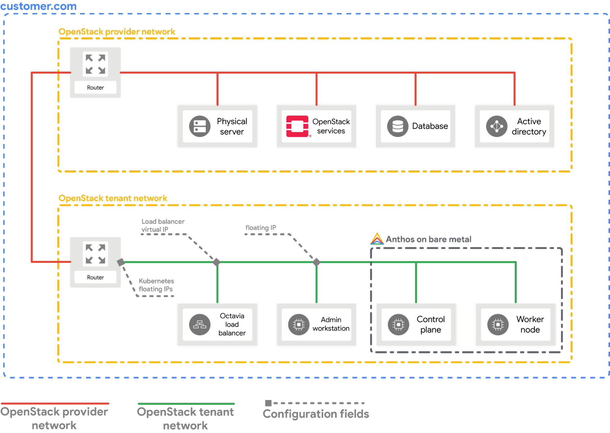

## Anthos on Bare Metal on OpenStack with Terraform

This sample shows you how to use Terraform to try Anthos clusters on bare
metal in High Availability (HA) mode using Virtual Machines (VMs) running on
[OpenStack](https://www.openstack.org/). The guide has been tested on OpenStack
[Ussuri](https://releases.openstack.org/ussuri/index.html) and assumes that you
already have a similar OpenStack environment running.

---
### Infrastructure on OpenStack

The [Quick start](docs/quickstart.md) guide sets up the following
infrastructure on your OpenStack environment. The diagram below assumes that
none of the default values for the [variables](variables.tf) were changed other
than the ones mentioned in the guide.

  

- Private Network for the VMs
- Private SSH key that is uploaded to all VMs
- External Load Balancer using Octavia LBaaS
- 3 Nova VMs ***(1 Admin workstation, 1 Control plane and 1 Worker node)***
- Router to provide external connectivity and for floating IP addresses
- Security Group that allows all ICMP and incoming TCP on port 22 and 443 from 0.0.0.0/0
- A [***cloud-config***](resources/cloud-config.yaml) that sets up SSH access to all VMs from all VMs under the user **`abm`**

---

### Pre-requisites
- A bare metal environment running [OpenStack Ussuri](https://releases.openstack.org/ussuri/index.html)
  or similar with [LBaaS v2](https://docs.openstack.org/mitaka/networking-guide/config-lbaas.html)
  configured and functional
  > If you don't have an OpenStack environment and still want to try this sample
    then first follow [this guide](/anthos-bm-openstack-terraform/docs/install_openstack_on_gce.md)
    to get an OpenStack _(Ussuri)_ environment running on a [Google Compute Engine VM with _nested KVM_](https://cloud.google.com/compute/docs/instances/nested-virtualization/overview).

- A workstation with access to internet _(i.e. Google Cloud APIs)_ with the
  following installed
  - [Git](https://www.atlassian.com/git/tutorials/install-git)
  - [Google Cloud SDK](https://cloud.google.com/sdk/docs/install)
  - [OpenStack CLI Client](https://docs.openstack.org/newton/user-guide/common/cli-install-openstack-command-line-clients.html)
  - [Terraform](https://learn.hashicorp.com/tutorials/terraform/install-cli) _(>=v0.15.5)_

- A [Google Cloud Project](https://console.cloud.google.com/cloud-resource-manager) _(which will host the Anthos Hub)_
- **Time**: this entire guide can take upto **45 minutes** to complete if you already have an OpenStack environment running

---
## Getting started

- [Deploy OpenStack Ussuri on GCE VM](/anthos-bm-openstack-terraform/docs/install_openstack_on_gce.md)
  - _(required only if you already don't have an **OpenStack Ussuri** or similar with **LBaaS v2** enabled)_
- [Quick start: Install Anthos Bare Metal on OpenStack](docs/quickstart.md)
