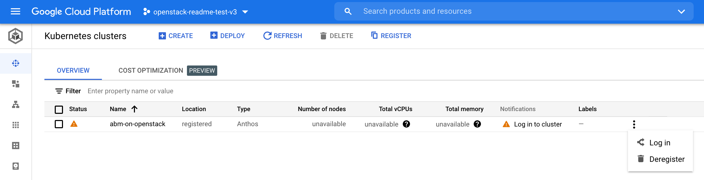
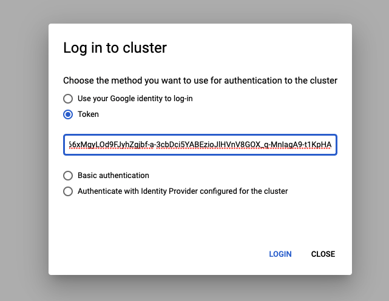
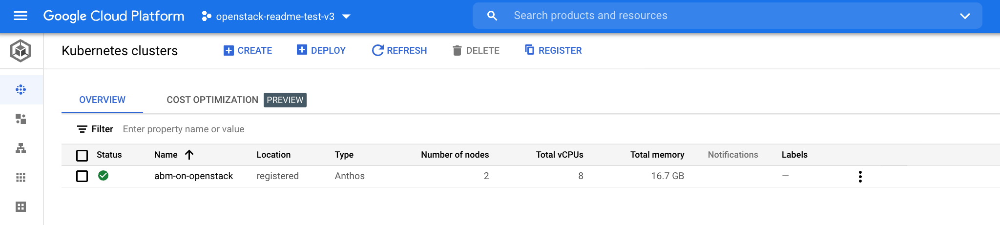

## Install Anthos on bare metal on OpenStack

This guide shows how to install Anthos on bare metal in your OpenStack
environment. It assumes that you already have an **OpenStack Ussuri** or similar
environment with the necessary VMs and network setup.

If you already have the necessary infrastructure set up in your OpenStack
environment, then you can continue with this guide. If not, the Terraform
scripts from the [previous guide](configure_openstack.md) shows how to create
the following VMs and the required networking between them.

  | VM Name  | IP Address    | Usage         |
  | ---------| ------------- | ------------- |
  | abm-ws   | 10.200.0.10 ***(private)***<br/>floating IP ***(public)*** | Acts as the **admin workstation** It is used to deploy Anthos on bare metal to the other machines.
  | abm-cp1  | 10.200.0.11   | **Anthos cluster control plane:**. This host runs the Kubernetes control plane and load balancer.
  | abm-w1   | 10.200.0.12   | **Anthos cluster worker node:** This host runs the Kubernetes workloads.

</br>

---
### 1. Configure the admin workstation VM on OpenStack

[Section 3.5](configure_openstack.md#35-apply-the-changes-described-in-the-terraform-script)
from the _configuring OpenStack guide_ would have created a VM in **OpenStack**
that will serve as our ***admin workstation***. We will confgure and use it to
install **Anthos on bare metal**.

#### 1.1) Fetch the Floating IP of the admin workstation
> **Note:** Use one of the two commands below to setup the environment variable

```sh
# fetch the ip address using the OpenStack API
export FLOATING_IP=$(openstack floating ip list --tags=abm_ws_floatingip -f json | jq -c '.[]."Floating IP Address"' | tr -d '"')

# echo and note down the floating IP
echo $FLOATING_IP
```

#### 1.2) Copy into and configure the initilization scripts in the admin workstation
```sh
# use the same SSH key used when creating the OpenStack VMs
export SSH_KEY_NAME="abmNodeKey"

scp -o IdentitiesOnly=yes -i ~/.ssh/${SSH_KEY_NAME} resources/abm* ubuntu@$FLOATING_IP:~

# SSH into the admin workstation
ssh -o IdentitiesOnly=yes -i ~/.ssh/${SSH_KEY_NAME} ubuntu@$FLOATING_IP

# switch to the "abm" user
sudo -u abm -i

# copy the initialization scripts into the "abm" user's $HOME
cp /home/ubuntu/abm* ./

# ensure that the initialization scripts are executable
chmod +x abm*

# verify that the files have been copied
ls -1
```
```sh
# -----------------------------------------------------
#                   Expected Output
# -----------------------------------------------------
abm_cluster.yaml.tpl
abm_cluster_login.sh
abm_init_host.sh
abm_setup_gcp.sh
```

> **Important:** *All the steps from here on forth are to be run inside the admin
> workstation, unless an explicit `exit` statement is provided*

#### 1.3) Verify SSH access to other nodes from the admin workstation
```sh
# ssh access into the control plane node
ssh abm@10.200.0.11 'echo SSH to $HOSTNAME succeeded'
```
```sh
# -----------------------------------------------------
#                   Expected Output
# -----------------------------------------------------
SSH to abm-cp1 succeeded
```

```sh
# ssh access into the worker node
ssh abm@10.200.0.12 'echo SSH to $HOSTNAME succeeded'
```
```sh
# -----------------------------------------------------
#                   Expected Output
# -----------------------------------------------------
SSH to abm-w1 succeeded
```

#### 1.4) Configure the shell environment in the admin workstation
```sh
# set the GCP Project where the Anthos Hub and Service Accounts will be setup
export PROJECT_ID="<YOUR_GCP_PROJECT_ID>"

# provide a name for the Service Account that will created for use by Anthos on bare metal
export SERVICE_ACCOUNT="abm-gcr"

# set the Anthos on bare metal version to use; for versions <1.8.2 see note below
export ABM_VERSION="1.8.4"

# set the Anthos on bare metal version to use
export ABM_CLUSTER_NAME="abm-on-openstack"

# log into Google Cloud via gcloud using your user account
gcloud auth login

# configure gcloud with the GCP Project to use
gcloud config set project $PROJECT_ID

# fetch the credentials for gcloud to use for authenticating against the Project
gcloud auth application-default login
```

> **Note:** For Anthos on bare metal versions `<1.8.2` please refer the [release
> notes](https://cloud.google.com/anthos/clusters/docs/bare-metal/latest/release-notes)
> for known issues. You can then look for workarounds for those issues in the
> [troubleshooting guide](https://cloud.google.com/anthos/clusters/docs/bare-metal/1.8/troubleshooting/known-issues).

#### 1.5) Install the necessary tools in the admin workstation
```sh
# this script will install the following tools:
#   - kubectl
#   - bmctl
#   - kind
#   - docker
./abm_init_host.sh
```
> **Note:** This step can take upto **60 seconds** to complete

#### 1.6) Initialize the Google Cloud Project as required for the Anthos on bare metal installation
```sh
# this script will do the following:
#   - enable GCP services
#   - create Service Account to be used by the installation process
#   - add IAM policy bindings for the Service Account
./abm_setup_gcp.sh
```
> **Note:** This step can take upto **60 seconds** to complete

---
### 2. Install Anthos on bare metal

#### 2.1) Create a workspace for the new Anthos on bare metal cluster
```sh
bmctl create config -c ${ABM_CLUSTER_NAME}
```

#### 2.2) Create a cluster configuration from the provided template file
```sh
envsubst < abm_cluster.yaml.tpl > bmctl-workspace/${ABM_CLUSTER_NAME}/${ABM_CLUSTER_NAME}.yaml
```

#### 2.3) Create the Anthos on bare metal cluster
```sh
bmctl create cluster -c ${ABM_CLUSTER_NAME}
```
```sh
# -----------------------------------------------------
#                   Expected Output
# -----------------------------------------------------
Please check the logs at bmctl-workspace/abm-on-openstack/log/create-cluster-20210926-020741/create-cluster.log
[2021-09-26 02:07:59+0000] Creating bootstrap cluster... ⠦ kind get kubeconfig --name bmctl > ~/.kube/config && k get pods --all-namespaces
[2021-09-26 02:07:59+0000] Creating bootstrap cluster... OK
[2021-09-26 02:10:48+0000] Installing dependency components... OK
[2021-09-26 02:13:42+0000] Waiting for preflight check job to finish... OK
[2021-09-26 02:15:22+0000] - Validation Category: machines and network
[2021-09-26 02:15:22+0000] 	- [PASSED] gcp
[2021-09-26 02:15:22+0000] 	- [PASSED] node-network
[2021-09-26 02:15:22+0000] 	- [PASSED] 10.200.0.11
[2021-09-26 02:15:22+0000] 	- [PASSED] 10.200.0.11-gcp
[2021-09-26 02:15:22+0000] 	- [PASSED] 10.200.0.12
[2021-09-26 02:15:22+0000] 	- [PASSED] 10.200.0.12-gcp
[2021-09-26 02:15:22+0000] Flushing logs... OK
[2021-09-26 02:15:23+0000] Applying resources for new cluster
[2021-09-26 02:15:24+0000] Waiting for cluster to become ready OK
[2021-09-26 02:25:04+0000] Writing kubeconfig file
[2021-09-26 02:25:04+0000] kubeconfig of created cluster is at bmctl-workspace/abm-on-openstack/abm-on-openstack-kubeconfig, please run
[2021-09-26 02:25:04+0000] kubectl --kubeconfig bmctl-workspace/abm-on-openstack/abm-on-openstack-kubeconfig get nodes
[2021-09-26 02:25:04+0000] to get cluster node status.
[2021-09-26 02:25:04+0000] Please restrict access to this file as it contains authentication credentials of your cluster.
[2021-09-26 02:25:04+0000] Waiting for node pools to become ready OK
[2021-09-26 02:25:24+0000] Moving admin cluster resources to the created admin cluster
[2021-09-26 02:25:53+0000] Flushing logs... OK
[2021-09-26 02:25:53+0000] Deleting bootstrap cluster...
```
> **Note 1:** _This step can take between ***15 to 20 minutes*** to complete_
>
> **Note 2:** See the [troubleshooting section](#troubleshooting-anthos-on-bare-metal-cluster-creation)
> for tips on how to monitor the above installation process

---
### 3. Verifying installation and interacting with the Anthos on bare metal cluster

You can find your cluster's `kubeconfig` file on the admin machine in the
`bmctl-workspace` directory. To verify your deployment, complete the following
steps.

#### 3.1) Try fetching the cluster node details using kubectl
```sh
export KUBECONFIG=bmctl-workspace/${ABM_CLUSTER_NAME}/${ABM_CLUSTER_NAME}-kubeconfig
kubectl get nodes
```
```sh
# -----------------------------------------------------
#                   Expected Output
# -----------------------------------------------------
NAME      STATUS   ROLES                  AGE     VERSION
abm-cp1   Ready    control-plane,master   5m24s   v1.20.5-gke.1301
abm-w1    Ready    <none>                 2m17s   v1.20.5-gke.1301
```

#### 3.2) Login to the Anthos on bare metal cluster in the Google Cloud console

During the setup process, your cluster will be auto-registered in Google Cloud
using [Connect](https://cloud.google.com/anthos/multicluster-management/connect/overview).
In order to interact with the cluster from the GCP console you must first **login**
to the cluster.

```sh
# run the utility script copied in section 4.2 to create Kubernetes Service Account
./abm_cluster_login.sh
```
```sh
# -----------------------------------------------------
#                   Expected Output
# -----------------------------------------------------
💡 Retreiving Kubernetes Service Account Token

🚀 ------------------------------TOKEN-------------------------------- 🚀
eyJhbGciOiJSUzI1NiIsImtpZCI6Imk2X3duZ3BzckQyWmszb09sZHFMN0FoWU9mV1kzOWNGZzMyb0x2WlMyalkifQ.eyJpc3MiOiJrdW
mljZS1hY2NvdW50LnVpZCI6IjQwYWQxNDk2LWM2MzEtNDhiNi05YmUxLWY5YzgwODJjYzgzOSIsInN1YiI6InN5c3RlbTpzZXJ2aWNlYW
iZXJuZXRlcy5pby9zZXJ2aWNlYWNjb3VudC9zZWNyZXQubmFtZSI6ImVkZ2Etc2EtdG9rZW4tc2R4MmQiLCJrdWJlcm5ldGVzLmlvL3Nl
cnZpY2VhY2NvdW50L3NlcnZpY2UtYWNjb3VudC5uYW1lIjoiZWRnYS1zYSIsImt1YmVybmV0ZXMuaW8vc2VydmljZWFjY291bnQvc2Vyd
4CwanGlof6s-fbu8IUy1_bTgCminylNKb3VudC5uYW1lIjoiZWRnYS1zYSIsImt1YmVybmV0ZXuaP-hDEKURb5O6IxulTXWH6dxYxg66x
Njb3VudDpkZWZhdWx0OmVkZ2Etc2EifQ.IXqXwX5pg9RIyNHJZTM6cBKTEWOMfQ4IQQa398f0qwuYlSe12CA1l6P8TInf0S1aood7NJWx
xe-5ojRvcG8pdOuINq2yHyQ5hM7K7R4h2qRwUznRwuzOp_eXC0z0Yg7VVXCkaqnUR1_NzK7qSu4LJcuLzkCYkFdSnvKIQABHSvfvZMrJP
Jlcm5ldGVzL3NlcnZpY2VhY2NvdW50Iiwia3ViZXJuZXRlcy5pby9zZXJ2aWNlYWNjb3VudC9uYW1lc3BhY2UiOiJkZWZhdWx0Iiwia3V
MgyLOd9FJyhZgjbf-a-3cbDci5YABEzioJlHVnV8GOX_q-MnIagA9-t1KpHA
🚀 ------------------------------------------------------------------- 🚀
```

Once you have run the above steps, copy the **`Token`** that is printed out and
login to the kubernetes cluster from the [`Kubernetes clusters page`](https://console.cloud.google.com/kubernetes/list/overview)
in the Google Cloud console.

<p align="center">
  
  
  
</p>

---
### What Next?
You can now install the **OpenStack Cloud Provider** on the newly created Anthos on
bare metal cluster by [following this guide](openstack_cloud_provider.md).
This enables you to expose your applications using a `LoadBalancer` type
service.

---
### Clean up

- If you used a fresh Google Cloud Project, then you can simply delete it
- If you used an existing Google Cloud Project, then you have to do the following:
  - **Deregister** the Anthos cluster from the [`Kubernetes clusters page`](https://console.cloud.google.com/kubernetes/list/overview) in the Google Cloud console
  - **Delete** the [`IAM Service Account`](https://console.cloud.google.com/iam-admin/serviceaccounts) with email username `abm-gcr`

---
### Troubleshooting Anthos on bare metal cluster creation
This section provides some guidance as to how to troubleshoot the bare metal
cluster installtion process _(step [**2.3**](#23-create-the-anthos-on-bare-metal-cluster))_.
The **bmctl** tool creates a [**Kind cluster**](https://kind.sigs.k8s.io/) to
bootstrap the Anthos on bare metal cluster installation process. So we can look
for logs from this **kind cluster** to see what's happening.

Whilst the bare metal cluster installation is happening, log into the **admin workstation**
from your **OpenStack** environment in a ***new terminal*** window.
```sh
# move into the directory where this repository was cloned
cd <PATH_TO_CLONE_LOCATION>/anthos-samples/anthos-bm-openstack-terraform

# note that the environment variables will not be available in the new shell
# get the FLOATING_IP using the terraform output (you can also use the OpenStack Web UI)
export FLOATING_IP=$(terraform output admin_ws_public_ip | tr -d '"')

# ssh into the admin workstation
# you have to replace "<SSH_KEY_NAME>" with the ssh key name used above
ssh -o IdentitiesOnly=yes -i ~/.ssh/<SSH_KEY_NAME> ubuntu@${FLOATING_IP}

# switch to the "abm" user
sudo -u abm -i
```

Once, `ssh`'ed into the **admin workstation**, wait until you see the following
output in the terminal window where the bare metal cluster installation is ongoing _(where step [**2.3**](#23-create-the-anthos-on-bare-metal-cluster) was run)_.
```sh
# this means that the bootstrap kind cluster has been created
"Installing dependency components..."
```

Now, setup the `KUBECONFIG` for the bootstrap `kind` cluster.
```sh
kind get kubeconfig --name bmctl > ~/.kube/config
```

Finally, interact with the boostrap cluster's pods to see their logs and debug.
```sh
kubectl get pods --all-namespaces
```

> **Note:** The **bootstrap kind cluster** will be deleted once the installation
> process ends. To prevent it from being deleted, use the `--reuse-bootstrap-cluster`
> flag when executing `bmctl create` in step [**2.3**](#23-create-the-anthos-on-bare-metal-cluster).
