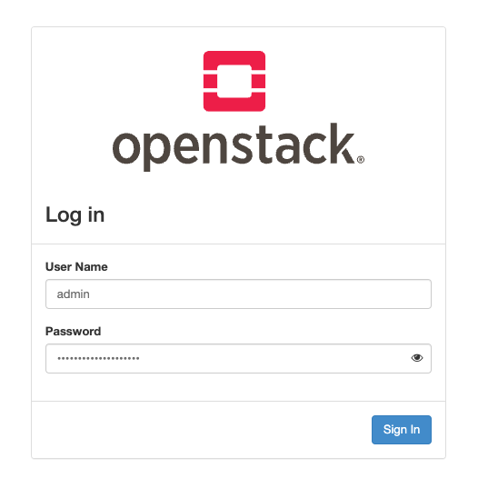
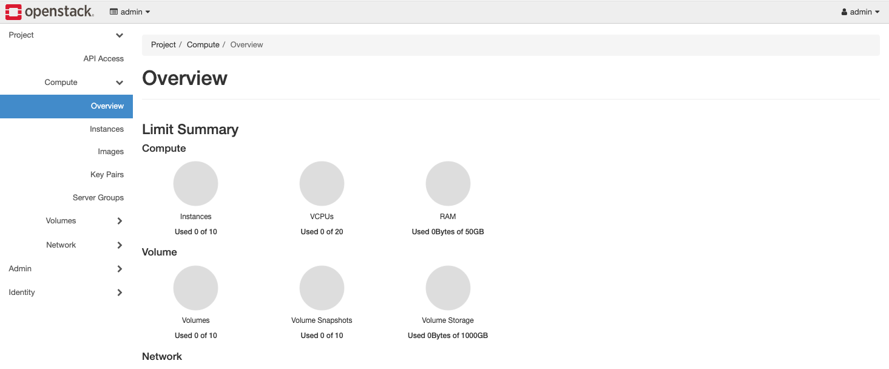
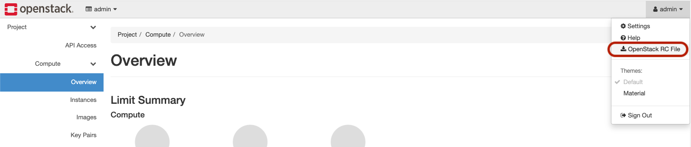
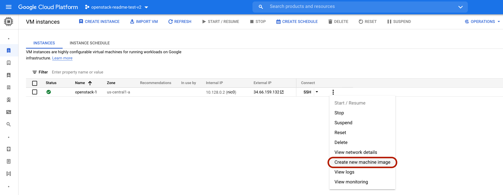

## Deploying OpenStack Ussuri on Google Compute Engine VMs

This guide explains how to install an OpenStack _(Ussuri)_ environment on Google
Compute Engine (GCE) VMs using [nested virtualization](https://cloud.google.com/compute/docs/instances/nested-virtualization/overview).

The guide is split into 4 sections:
- Create a GCE instance with KVM enabled in Google Cloud Platform
- Install **OpenStack Ussuri** using the **[openstack-ansible in all-in-one](https://docs.openstack.org/openstack-ansible/latest/user/aio/quickstart.html)** mode
- Setup proper TLS certificates for accessing **OpenStack** your workstation
- Access and validate the deployed environment

Nested virtualization refers to the ability of running a virtual machine within
another, enabling this general concept extendable to an arbitrary depth.
Using nested KVM allows us to have minimal performance degradation when
OpenStack spins up user VMs in the GCE VM.

> **Note:** This is only for experimental purposes for trying OpenStack, **not**
> for running any actual workloads
---
### Pre-requisites
- A [Google Cloud Project](https://console.cloud.google.com/cloud-resource-manager) _(in which the resources for the setup will be provisioned)_
- A workstation with access to internet _(i.e. Google Cloud APIs)_ with the
  following installed
  - [Google Cloud SDK](https://cloud.google.com/sdk/docs/install)
  - [OpenStack CLI Client](https://docs.openstack.org/newton/user-guide/common/cli-install-openstack-command-line-clients.html) (>= 5.5.x)
  - [sshuttle tool](https://sshuttle.readthedocs.io/en/stable/)

---

### 1. Create a GCE instance with KVM enabled in Google Cloud Platform

In this section we will create an `Ubuntu 20.04` _(Focal Fossa)_ image that has
a special license attached. Note that this is required; at this point in time
you can not enable nested KVM without this license being attached. So you have
to create a new GCE VM and can’t use nested KVM on an existing GCE instance.

#### 1.1) Setup your environment.
```sh
export PROJECT_ID="<YOUR_GCP_PROJECT_ID>"
export REGION="us-central1"   # this is an example; change to your preferred choice
export ZONE="us-central1-a"   # this is an example; change to your preferred choice

gcloud config set project "${PROJECT_ID}"
gcloud services enable compute.googleapis.com

gcloud config set compute/region "${REGION}"
gcloud config set compute/zone "${ZONE}"
```
> **Note:** This step can take upto **90 seconds** to complete given the step for
> enabling the `Compute` APIs

#### 1.2) Create a Compute Engine Disk.
```sh
gcloud compute disks create ubuntu2004disk \
    --image-project ubuntu-os-cloud \
    --image-family ubuntu-2004-lts \
    --zone ${ZONE}
```

#### 1.3) Create a `Ubuntu 20.04` image with the _required license for nested virtualization_.
```sh
gcloud compute images create ubuntu-2004-nested \
    --source-disk ubuntu2004disk \
    --source-disk-zone ${ZONE} \
    --licenses "https://www.googleapis.com/compute/v1/projects/vm-options/global/licenses/enable-vmx"
```

#### 1.4) Create the GCE VM where we will install and run OpenStack.
```sh
gcloud compute instances create openstack-1 \
    --zone ${ZONE} \
    --image ubuntu-2004-nested \
    --boot-disk-size 600G \
    --boot-disk-type pd-ssd \
    --can-ip-forward \
    --network default \
    --tags http-server,https-server,novnc,openstack-apis \
    --min-cpu-platform "Intel Haswell" \
    --machine-type n1-standard-32
```

#### 1.5) Get the `Internal` and `External` IPs assigned to the created GCE VM.
```sh
# get the internal IP
export INTERNAL_IP=$(gcloud compute instances describe openstack-1 \
    --zone ${ZONE} \
    --format='get(networkInterfaces[0].networkIP)')

# get the external IP
export EXTERNAL_IP=$(gcloud compute instances describe openstack-1 \
    --zone ${ZONE} \
    --format='get(networkInterfaces[0].accessConfigs[0].natIP)')

# echo and note them down somewhere, since when you need it next you will be
# SSH'ed into the GCE instance and won't have access to this shell session
echo $INTERNAL_IP
echo $EXTERNAL_IP
```
> **Note:** We will need these two IP addresses in a [later step](#3-setup-proper-tls-certificates-for-accessing-openstack-your-workstation), so note it
> down somewhere

#### 1.6) Create Firewall rules to expose the Web UI and [noVNC](https://novnc.com/info.html).
```sh
gcloud compute firewall-rules create default-allow-novnc \
    --network default \
    --source-ranges 0.0.0.0/0 \
    --target-tags novnc \
    --direction ingress \
    --allow tcp:6080

gcloud compute firewall-rules create default-allow-openstack-apis \
    --network default \
    --source-ranges 0.0.0.0/0 \
    --target-tags openstack-apis \
    --direction ingress \
    --allow tcp:8773-8777

# The following 2 firewall rules are likely already created so don't worry if it
# fails with: "The resource 'bl/default-allow-http' already exists"
gcloud compute firewall-rules create default-allow-http \
    --network default \
    --source-ranges 0.0.0.0/0 \
    --target-tags http-server \
    --direction ingress \
    --allow tcp:80

gcloud compute firewall-rules create default-allow-https \
    --network default \
    --source-ranges 0.0.0.0/0 \
    --target-tags https-server \
    --direction ingress \
    --allow tcp:443
```

#### 1.7) SSH into the VM and install KVM.
```sh
# SSH into the GCE instance
gcloud compute ssh openstack-1 --zone ${ZONE}

# once inside the GCE instance, then install KVM as sudo
sudo -i
apt-get update && apt-get install qemu-kvm -y
```

#### 1.8) Verify that KVM has been installed successfully.
```sh
kvm-ok

# -----------------------------------------------------
#                   Expected Output
# -----------------------------------------------------
INFO: /dev/kvm exists
KVM acceleration can be used
```

> **Note:** In case you hit any issues, please take a look at the [Nested KVM
> docs for GCP](https://cloud.google.com/compute/docs/instances/enable-nested-virtualization-vm-instances).
---
### 2. Install _OpenStack Ussuri_ using the _openstack-ansible in all-in-one_ mode

#### 2.1) Clone the **OpenStack** repository into the GCE instance.
```sh
### NOTE: YOU MUST BE SSH'ed INTO THE 'openstack-1' GCE VM WE CREATED

# start a screen session because some commands are going to take a while you
# can always re-attach later with "screen -r -D" if you lose your SSH session
screen

git clone https://opendev.org/openstack/openstack-ansible /opt/openstack-ansible
cd /opt/openstack-ansible
git checkout stable/ussuri
```

#### 2.2) Install [Ansible](https://www.ansible.com/) and all the required Ansible roles on the GCE instance.
```sh
scripts/bootstrap-ansible.sh

# -----------------------------------------------------
#                   Expected Output
# -----------------------------------------------------
PLAY RECAP *************************************************************************************************************************
localhost                  : ok=9    changed=3    unreachable=0    failed=0    skipped=7    rescued=0    ignored=0

+ popd
/opt/openstack-ansible
+ unset ANSIBLE_LIBRARY
+ unset ANSIBLE_LOOKUP_PLUGINS
+ unset ANSIBLE_FILTER_PLUGINS
+ unset ANSIBLE_ACTION_PLUGINS
+ unset ANSIBLE_CALLBACK_PLUGINS
+ unset ANSIBLE_CALLBACK_WHITELIST
+ unset ANSIBLE_TEST_PLUGINS
+ unset ANSIBLE_VARS_PLUGINS
+ unset ANSIBLE_STRATEGY_PLUGINS
+ unset ANSIBLE_CONFIG
+ echo 'System is bootstrapped and ready for use.'
System is bootstrapped and ready for use.
```
> **Note:** _This step can take upto ***3 minutes and 30 seconds*** to complete_

#### 2.3) Setup the environment on the GCE instance for **OpenStack** installation.
```sh
export SCENARIO='aio_lxc_barbican_octavia'
# run the following script again if you hit any issues
scripts/bootstrap-aio.sh

# -----------------------------------------------------
#                   Expected Output
# -----------------------------------------------------
PLAY RECAP *************************************************************************************************************************
localhost                  : ok=130  changed=61   unreachable=0    failed=0    skipped=39   rescued=0    ignored=0

EXIT NOTICE [Playbook execution success] **************************************
===============================================================================
+ popd
/opt/openstack-ansible
+ unset ANSIBLE_INVENTORY
+ unset ANSIBLE_VARS_PLUGINS
+ unset HOST_VARS_PATH
+ unset GROUP_VARS_PATH
```

> **Note:** _This step can take upto ***2 minutes and 30 seconds*** to complete_

#### 2.4) Make a change to the Ansible playbook configs to overcome a [known issue](https://bugs.launchpad.net/openstack-ansible/+bug/1903344).
```sh
# take a copy of the configuration file
cp /etc/ansible/roles/openstack_hosts/defaults/main.yml /etc/ansible/roles/openstack_hosts/defaults/main.yml.backup

# change line 109 as follows
sed -i "s/{ key: 'net.bridge.bridge-nf-call-iptables', value: 1 }/{ key: 'net.bridge.bridge-nf-call-iptables', value: 0 }/g" \
        /etc/ansible/roles/openstack_hosts/defaults/main.yml

# validate the change
diff /etc/ansible/roles/openstack_hosts/defaults/main.yml /etc/ansible/roles/openstack_hosts/defaults/main.yml.backup

# -----------------------------------------------------
#                   Expected Output
# -----------------------------------------------------
109c109
<   - { key: 'net.bridge.bridge-nf-call-iptables', value: 0 }
---
>   - { key: 'net.bridge.bridge-nf-call-iptables', value: 1 }
```

#### 2.5) Run the ansible-playbooks to install **OpenStack Ussuri** on the GCE instance.
```sh
openstack-ansible \
    playbooks/setup-hosts.yml \
    playbooks/setup-infrastructure.yml \
    playbooks/setup-openstack.yml

# -----------------------------------------------------
#                   Expected Output
# -----------------------------------------------------
PLAY RECAP *************************************************************************************************************************
aio1                                    : ok=500  changed=216  unreachable=0    failed=0    skipped=204  rescued=0    ignored=0
aio1_barbican_container-0de710ea        : ok=183  changed=100  unreachable=0    failed=0    skipped=42   rescued=0    ignored=0
aio1_cinder_api_container-ad124741      : ok=238  changed=116  unreachable=0    failed=0    skipped=51   rescued=0    ignored=0
aio1_galera_container-74407745          : ok=140  changed=71   unreachable=0    failed=0    skipped=20   rescued=0    ignored=0
aio1_glance_container-a54deb97          : ok=206  changed=103  unreachable=0    failed=0    skipped=45   rescued=0    ignored=0
aio1_horizon_container-5f9448d5         : ok=152  changed=83   unreachable=0    failed=0    skipped=31   rescued=0    ignored=0
aio1_keystone_container-0e3600da        : ok=208  changed=103  unreachable=0    failed=0    skipped=63   rescued=0    ignored=0
aio1_memcached_container-13f77ac9       : ok=103  changed=54   unreachable=0    failed=0    skipped=18   rescued=0    ignored=0
aio1_neutron_server_container-58626da0  : ok=175  changed=95   unreachable=0    failed=0    skipped=36   rescued=0    ignored=0
aio1_nova_api_container-5e6a8727        : ok=235  changed=115  unreachable=0    failed=0    skipped=56   rescued=0    ignored=0
aio1_octavia_server_container-96d05879  : ok=231  changed=133  unreachable=0    failed=0    skipped=37   rescued=0    ignored=0
aio1_placement_container-fb0d80cc       : ok=178  changed=93   unreachable=0    failed=0    skipped=35   rescued=0    ignored=0
aio1_rabbit_mq_container-1bde823a       : ok=147  changed=70   unreachable=0    failed=0    skipped=23   rescued=0    ignored=0
aio1_repo_container-043a9681            : ok=112  changed=59   unreachable=0    failed=0    skipped=24   rescued=0    ignored=0
aio1_utility_container-d8e19ea8         : ok=219  changed=114  unreachable=0    failed=0    skipped=76   rescued=0    ignored=0
localhost                               : ok=3    changed=3    unreachable=0    failed=0    skipped=1    rescued=0    ignored=0

EXIT NOTICE [Playbook execution success] **************************************
===============================================================================
```

> **Note 1:** _This step can take upto ***55 minutes*** to complete_
>
> **Note 2:** If the output says `Playbook execution failed` and the only
> failure was (`failed=1`) on the **aio1_utility_container**, then you can
> safely ignore it and continue
>
> **Note 3:** Sometimes you might hit an issue where the **setup-hosts.yml** playbook hangs with `RETRYING: Ensure that the LXC cache has been prepared (14 retries left)`. The root cause is that downloading the packages sometimes gets stuck, so just rerun the playbook **openstack-ansible playbooks/setup-hosts.yml**. You can read more about using openstack-ansible [here](https://docs.openstack.org/openstack-ansible/stein/user/aio/quickstart.html)
>
>

---

### 3. Setup proper TLS certificates for accessing OpenStack your workstation

#### 3.1) Download the [utility script](/anthos-bm-openstack-terraform/resources/create-certs.sh) to create a self-signed certificate with IP SAN.

```sh
wget https://raw.githubusercontent.com/GoogleCloudPlatform/anthos-samples/main/anthos-bm-openstack-terraform/resources/create-certs.sh
```

#### 3.2) Edit the script to match your IP addresses and hostnames.
```sh
# make a copy of the script
cp create-certs.sh.backup create-certs.sh

# replace 'xx.xx.xx.xx' in the following command with the External IP of this GCE VM
sed -i 's/<EXTERNAL_IP>/xx.xx.xx.xx/g' create-certs.sh

# replace 'xx.xx.xx.xx' in the following command with the Internal IP of this GCE VM
sed -i 's/<INTERNAL_IP>/xx.xx.xx.xx/g' create-certs.sh

# validate that the changes to the script
diff create-certs.sh create-certs.sh.backup

# -----------------------------------------------------
#                   Expected Output
# -----------------------------------------------------
31c31
< CN = 35.222.172.0
---
> CN = <EXTERNAL_IP>
45,54c45,54
< IP.1  = 35.222.172.0
< IP.2  = 10.128.0.2
< DNS.1 = 35.222.172.0
< DNS.2 = 35.222.172.0:5000
< DNS.3 = 35.222.172.0:9876
< DNS.4 = 35.222.172.0:8780
< DNS.5 = 10.128.0.2
< DNS.6 = 10.128.0.2:5000
< DNS.7 = 10.128.0.2:9876
< DNS.8 = 10.128.0.2:8780
---
> IP.1  = <EXTERNAL_IP>
> IP.2  = <INTERNAL_IP>
> DNS.1 = <EXTERNAL_IP>
> DNS.2 = <EXTERNAL_IP>:5000
> DNS.3 = <EXTERNAL_IP>:9876
> DNS.4 = <EXTERNAL_IP>:8780
> DNS.5 = <INTERNAL_IP>
> DNS.6 = <INTERNAL_IP>:5000
> DNS.7 = <INTERNAL_IP>:9876
> DNS.8 = <INTERNAL_IP>:8780
```

> **Note:** The IP addresses in the above output will be different for you

#### 3.3) Generate the certificates using the downloaded [utility script](/anthos-bm-openstack-terraform/resources/create-certs.sh).

```sh
# running this will create all the necessary certificates inside a folder called "tls"
bash create-certs.sh
```

#### 3.4) Configure the **OpenStack HA-Proxy** to use the newly generated certificate files.

```sh
# move the necessary files to proper location
mkdir /etc/openstack_deploy/ssl/
cp tls/my-service.crt /etc/openstack_deploy/ssl/openstack.crt
cp tls/my-service.key /etc/openstack_deploy/ssl/openstack.key
cp tls/ca.crt /etc/openstack_deploy/ssl/ca.crt

# Update the configuration file to point to these file paths
cat >> /etc/openstack_deploy/user_variables.yml << EOF
haproxy_user_ssl_cert: /etc/openstack_deploy/ssl/openstack.crt
haproxy_user_ssl_key: /etc/openstack_deploy/ssl/openstack.key
haproxy_user_ssl_ca_cert: /etc/openstack_deploy/ssl/ca.crt
EOF

# run the ansible playbook to configure the ha-proxy
cd /opt/openstack-ansible/playbooks/
openstack-ansible haproxy-install.yml

# -----------------------------------------------------
#                   Expected Output
# -----------------------------------------------------
PLAY RECAP *************************************************************************************************************************
aio1                       : ok=29   changed=5    unreachable=0    failed=0    skipped=20   rescued=0    ignored=0

EXIT NOTICE [Playbook execution success] **************************************
===============================================================================
```

> **Note:** _This step can take upto ***40 seconds*** to complete_

### 4. Access and validate the deployed environment

#### 4.1) Validate access to the **OpenStack** server from inside the GCE VM.
```sh
### NOTE: YOU MUST BE STILL SSH'ed INTO THE 'openstack-1' GCE VM WE CREATED

# get into the utility container using the native lxc-attach command
lxc-attach -n `lxc-ls -1 | grep utility | head -n 1`

# now you should be inside the utility container
source ~/openrc

# see if you are able to list the endpoints from the OpenStack server
openstack endpoint list

# -----------------------------------------------------
#                   Expected Output
# -----------------------------------------------------
+----------------------------------+-----------+--------------+---------------+---------+-----------+---------------------------------------------+
| ID                               | Region    | Service Name | Service Type  | Enabled | Interface | URL                                         |
+----------------------------------+-----------+--------------+---------------+---------+-----------+---------------------------------------------+
| 03e84f47ebbe435cb87865da0b780d28 | RegionOne | placement    | placement     | True    | public    | https://10.128.0.2:8780                     |
| 067e51258831471e9d936f66c24353e8 | RegionOne | placement    | placement     | True    | admin     | http://172.29.236.100:8780                  |
| 0c1e5ae42269481a8aed9caf6cb7b456 | RegionOne | keystone     | identity      | True    | admin     | http://172.29.236.100:5000                  |
| 0efcdfe9c3124331b1cdf40d1c9da509 | RegionOne | keystone     | identity      | True    | public    | https://10.128.0.2:5000                     |
| 13a1b08e1cde484094aec1bf932be43c | RegionOne | cinderv3     | volumev3      | True    | public    | https://10.128.0.2:8776/v3/%(tenant_id)s    |
| 17285e1785e8439c9d204cfe2fa74437 | RegionOne | cinderv3     | volumev3      | True    | internal  | http://172.29.236.100:8776/v3/%(tenant_id)s |
| 269407b75c6546db9bfa82cd7e52c7c0 | RegionOne | cinderv3     | volumev3      | True    | admin     | http://172.29.236.100:8776/v3/%(tenant_id)s |
| ...                                                                                                                                             |
| ...                                                                                                                                             |
| ...                                                                                                                                             |
+----------------------------------+-----------+--------------+---------------+---------+-----------+---------------------------------------------+

# exit from the utility container
exit
```

#### 4.2) Get the `password` for the **OpenStack** admin user.
```sh
# copy the output and note it somewhere
grep "keystone_auth_admin_password" /etc/openstack_deploy/user_secrets.yml
```

#### 4.3) Exit out of the GCE instance where **OpenStack** is running.
```sh
# you might have to type exit 2 times or 3-times until you get to your workstation shell
# workstation -> GCE VM -> sudo user in GCE VM -> screen session
exit
```

#### 4.3) Access the **OpenStack** API server via the `External IP` of the GCE instance.
```sh
### NOTE: YOU MUST BE IN THE ORIGINAL TERMINAL SESSION IN YOUR WORKSTATION

# The terminal session should already have the `EXTERNAL_IP` environment variable
# if not regenerate by following steps in section 1.5
echo https://$EXTERNAL_IP
```

Copy the output of the previous step and try accessing it _(URL)_ in a browser.
Use `admin` as the **username** and the value copied from step **[4.2](#42-get-the-password-for-the-openstack-admin-user)**
as the `password` to log into the **OpenStack UI**.

<p align="center">
  
</p>
<p align="center">
  
</p>

Use the toggle on the ***top right corner*** to download the `admin-openrc.sh`
file. This file contains the configurations needed by the `openstack CLI client`.

<p align="center">
  
</p>

#### 4.4) Move and source the downloaded `admin-openrc.sh` file into your working directory in the current terminal.

```sh
mv <DOWNLOAD_PATH>/admin-openrc.sh ./

# you will see a prompt to enter the password; use the password from step 4.2
source ./admin-openrc.sh
```

#### 4.5) Create a VPN tunnel to route traffic to the **OpenStack** APIs

The **openstack CLI** client uses the ***keystone identity API*** for
authentication. The ***keystone identity API*** is only reachable via the
*Internal IP* address of the GCE VM.

You can notice _(if you see the contents of the `admin-openrc.sh` file)_ the
`OS_AUTH_URL` is set to point to the *Intenal IP* of the GCE VM. However, since
the *Intenal IP* is only reachable from within the Google Cloud VPC we will use
[sshuttle](https://sshuttle.readthedocs.io/en/stable/) to set up a VPN tunnel
to route **OpenStack** traffic via the *External IP* of the GCE VM.

In a seperate new terminal window execute the following command:
- Replace `<YOUR_GCP_USERNAME>` with the username associated to to the Google Cloud Account you are using
- Replace `<EXTERNAL_IP>` with the External IP of the GCE VM _(the new terminal will not have the environment variable)_
```sh
# this will route any traffic to IPs within the given CIDRs via the External IP of the VM
sshuttle -r <YOUR_GCP_USERNAME>@<EXTERNAL_IP> 10.0.0.0/8 172.16.0.0/12 192.168.0.0/16
```
Keep it running and continue with the next steps in your original terminal
window.

#### 4.6) Download the `CA Certificate`

This is the `CA Certificate` created when configuring the **OpenStack HA-Proxy**
in step [**3.4**](#34-configure-the-openstack-ha-proxy-to-use-the-newly-generated-certificate).
This certificate is required by openstack clients.

```sh
gcloud compute scp --zone=${ZONE} \
    root@openstack-1:/opt/openstack-ansible/tls/ca.crt \
    ~/.ssh/openstack-ca.crt

export OS_CACERT=~/.ssh/openstack-ca.crt
```

#### 4.7) Now you should be able to use the **openstack CLI** client and also access the **OpenStack** Web UI via the *Internal IP* of the GCE VM.

```sh
openstack endpoint list

# -----------------------------------------------------
#                   Expected Output
# -----------------------------------------------------
+----------------------------------+-----------+--------------+---------------+---------+-----------+---------------------------------------------+
| ID                               | Region    | Service Name | Service Type  | Enabled | Interface | URL                                         |
+----------------------------------+-----------+--------------+---------------+---------+-----------+---------------------------------------------+
| 03e84f47ebbe435cb87865da0b780d28 | RegionOne | placement    | placement     | True    | public    | https://10.128.0.2:8780                     |
| 067e51258831471e9d936f66c24353e8 | RegionOne | placement    | placement     | True    | admin     | http://172.29.236.100:8780                  |
| 0c1e5ae42269481a8aed9caf6cb7b456 | RegionOne | keystone     | identity      | True    | admin     | http://172.29.236.100:5000                  |
| 0efcdfe9c3124331b1cdf40d1c9da509 | RegionOne | keystone     | identity      | True    | public    | https://10.128.0.2:5000                     |
| 13a1b08e1cde484094aec1bf932be43c | RegionOne | cinderv3     | volumev3      | True    | public    | https://10.128.0.2:8776/v3/%(tenant_id)s    |
| 17285e1785e8439c9d204cfe2fa74437 | RegionOne | cinderv3     | volumev3      | True    | internal  | http://172.29.236.100:8776/v3/%(tenant_id)s |
| 269407b75c6546db9bfa82cd7e52c7c0 | RegionOne | cinderv3     | volumev3      | True    | admin     | http://172.29.236.100:8776/v3/%(tenant_id)s |
| ...                                                                                                                                             |
| ...                                                                                                                                             |
| ...                                                                                                                                             |
+----------------------------------+-----------+--------------+---------------+---------+-----------+---------------------------------------------+

# try visiting the URL from the output of the following command in a browser
echo https://$INTERNAL_IP
```
---

### Pro Tip!

If you want to re-create a similar **OpenStack installation on GCE VM** again,
now is a good time to `Create new machine image` of the GCE VM we created in
this guide.

Next time, instead of running all the steps above you can simply create a VM
from thi machine image.

<p align="center">
  
</p>

---
### Clean up

- If you used a fresh Google Cloud Project, then simply delete it
- If you used an existing Google Cloud Project, then just delete the GCE VM `openstack-1`
