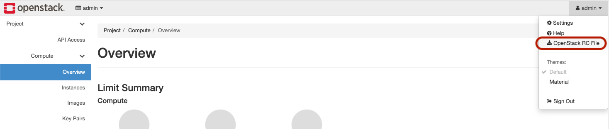

## Quick starter

### 1. Setup local environment

#### 1.1) Clone this repository

```sh
git clone https://github.com/GoogleCloudPlatform/anthos-samples.git
cd anthos-samples/anthos-bm-openstack-terraform
```

#### 1.2) Download the `openrc` file
You should be able to download it from **OpenStack Web UI**

<p align="center">
  
</p>

> **Note:** See the official **OpenStack** [docs on how to retrieve an `openrc` file](https://docs.openstack.org/ocata/user-guide/common/cli-set-environment-variables-using-openstack-rc.html)

#### 1.3) Verify access to your OpenStack environment

After you’ve downloaded the `openrc` file source it and verify access the **OpenStack**
APIs and that **load-balancer API** is enabled:

```sh
source <PATH_TO_OPENRC_FILE>/openrc.sh

openstack endpoint list --service=load-balancer

# -----------------------------------------------------
#                   Expected Output
# -----------------------------------------------------
+----------------------------------+-----------+--------------+---------------+---------+-----------+----------------------------+
| ID                               | Region    | Service Name | Service Type  | Enabled | Interface | URL                        |
+----------------------------------+-----------+--------------+---------------+---------+-----------+----------------------------+
| 0ffcbddd6d6147c5b70cc70db6c22fad | RegionOne | octavia      | load-balancer | True    | admin     | http://172.29.236.100:9876 |
| 39ec24b9b0e143eeb6ffae19aea06b2f | RegionOne | octavia      | load-balancer | True    | public    | https://10.128.0.2:9876    |
| f3b4da3c47ed454baac2d7988c255cce | RegionOne | octavia      | load-balancer | True    | internal  | http://172.29.236.100:9876 |
+----------------------------------+-----------+--------------+---------------+---------+-----------+----------------------------+
```

---
### 2. Setup OpenStack environment

#### 2.1) Upload Ubuntu 20.04 (Focal Fossa) image to OpenStack
```sh
# download the image from the public Ubuntu image repository
curl -O https://cloud-images.ubuntu.com/focal/current/focal-server-cloudimg-amd64.img

# upload it to OpenStack
openstack image create ubuntu-2004 \
	--disk-format qcow2 \
   	--container-format bare --public \
   	--file focal-server-cloudimg-amd64.img
```

#### 2.2) Create and upload SSH keys to be used by the OpenStack VMs
```sh
export SSH_KEY_NAME="abmNodeKey"
# generate the key pair
ssh-keygen -t -f ./${SSH_KEY_NAME}

# upload it to OpenStack
openstack keypair create $SSH_KEY_NAME --public-key ./${SSH_KEY_NAME}.pub
```

#### 2.3) Create OpenStack falvors that can be used to create VMs
```sh
openstack flavor create --id 0 --ram 512   --vcpus 1 --disk 10  m1.tiny
openstack flavor create --id 1 --ram 1024  --vcpus 1 --disk 20  m1.small
openstack flavor create --id 2 --ram 2048  --vcpus 2 --disk 40  m1.medium
openstack flavor create --id 3 --ram 4096  --vcpus 2 --disk 80  m1.large
openstack flavor create --id 4 --ram 8192  --vcpus 4 --disk 160 m1.xlarge
openstack flavor create --id 5 --ram 16384 --vcpus 6 --disk 320 m1.jumbo
```

#### 2.4) Verify that resources were created in OpenStack
```sh
openstack image list

# -----------------------------------------------------
#                   Expected Output
# -----------------------------------------------------
+--------------------------------------+---------------------+--------+
| ID                                   | Name                | Status |
+--------------------------------------+---------------------+--------+
| 9afa8795-223d-4a77-80d3-12c153f0fb3e | amphora-x64-haproxy | active |
| 7536b9f1-44ef-40e3-bdd5-82badba4c77f | cirros              | active |
| 4188935a-9025-4f80-b1f5-8012bc553b20 | ubuntu-2004         | active |
+--------------------------------------+---------------------+--------+

openstack keypair list

# -----------------------------------------------------
#                   Expected Output
# -----------------------------------------------------
+------------+-------------------------------------------------+------+
| Name       | Fingerprint                                     | Type |
+------------+-------------------------------------------------+------+
| abmNodeKey | 25:fb:10:3c:ab:63:b1:3c:7d:df:35:78:46:f2:d7:f4 | ssh  |
+------------+-------------------------------------------------+------+

openstack flavor list

# -----------------------------------------------------
#                   Expected Output
# -----------------------------------------------------
+-----+-----------+-------+------+-----------+-------+-----------+
| ID  | Name      |   RAM | Disk | Ephemeral | VCPUs | Is Public |
+-----+-----------+-------+------+-----------+-------+-----------+
| 0   | m1.tiny   |   512 |   10 |         0 |     1 | True      |
| 1   | m1.small  |  1024 |   20 |         0 |     1 | True      |
| 2   | m1.medium |  2048 |   40 |         0 |     2 | True      |
| 3   | m1.large  |  4096 |   80 |         0 |     2 | True      |
| 4   | m1.xlarge |  8192 |  160 |         0 |     4 | True      |
| 5   | m1.jumbo  | 16384 |  320 |         0 |     6 | True      |
+-----+-----------+-------+------+-----------+-------+-----------+
```

> **Note:** If you already have other resources in your **OpenStack**
> environment, those will also show up in the output above
---

### 3. Configure and execute Terraform

#### 3.1) Find the public `network id` in your OpenStack environment
```sh
# you can use this one line command if you have `jq` CLI tool installed
# if not use the "openstack network list --name=public" command to get the ID
export PUBLIC_NETWORK_ID=$(openstack network list --name=public -f json | jq -c '.[]."ID"' | tr -d '"')

# make sure you have the PUBLIC_NETWORK_ID environment variable is set
echo $PUBLIC_NETWORK_ID
```

#### 3.2) Generate the Terraform variables file
```sh
cat > terraform.tfvars << EOF
external_network_id = "$PUBLIC_NETWORK_ID"
os_user_name        = "$OS_USERNAME"
os_tenant_name      = "$OS_TENANT_NAME"
os_password         = "$OS_PASSWORD"
os_auth_url         = "$OS_AUTH_URL"
os_endpoint_type    = "$OS_ENDPOINT_TYPE"
ssh_key_name		    = "$SSH_KEY_NAME"
EOF

# see it's contents
cat terraform.tfvars

# -----------------------------------------------------
#                   Expected Output
# -----------------------------------------------------
external_network_id = "abce7af2-db6a-47db-b4dc-04598a73ec2d"
os_user_name        = "admin"
os_tenant_name      = ""
os_password         = "54e53c4ecc76fa84bec1374894583b8651332e0abe45c1de421ba797f669f35"
os_auth_url         = "https://10.128.0.2:5000"
os_endpoint_type    = ""
ssh_key_name		    = "abmNodeKey"
```

#### 3.3) Initialize Terraform
```sh
# this sets up the required Terraform state management configurations, similar to 'git init'
terraform init
```

#### 3.4) Create a _Terraform execution_ plan
```sh
# compares the state of the resources, verifies the scripts and creates an execution plan
terraform plan
```

#### 3.5) Apply the changes described in the Terraform script
Review the **Terraform** script _([main.tf](/main.tf))_ to see details of the
configuration. Running this script will create the required VMs and setup the
networking inside OpenStack to install Anthos on Bare Metal.

```sh
# executes the plan on the given provider (i.e: GCP) to reach the desired state of resources
terraform apply

# -----------------------------------------------------
#                   Expected Output
# -----------------------------------------------------
Apply complete! Resources: 18 added, 0 changed, 0 destroyed.

Outputs:

admin_ws_public_ip = "172.29.249.165"
```
> **Note 1:** This step can take upto **X seconds** to complete
>
> **Note 2:** When prompted to confirm the Terraform plan, type 'Yes' and enter

---
### 3. Configure the admin workstation VM on OpenStack
Running the **Terraform** scripts from section [3.5](#35-apply-the-changes-described-in-the-terraform-script)
would have created a VM in **OpenStack** that will serve as our ***admin workstation***.
We will confgure and use it to install **Anthos on Bare Metal**.

#### 3.1) Fetch the Floating IP of the admin workstation
> **Note:** Use one of the two commands below to setup the environment variable

```sh
# fetch the ip address using the Terraform output
export FLOATING_IP=$(terraform output admin_ws_public_ip | tr -d '"')

# fetch the ip address using the OpenStack API
export FLOATING_IP=$(openstack floating ip list --tags=abm_ws_floatingip -f json | jq -c '.[]."Floating IP Address"' | tr -d '"')
```

#### 3.2) Copy into and configure the initilization scripts in the admin workstation
```sh
scp resources/abm* ubuntu@$FLOATING_IP:~

# SSH into the admin workstation
ssh ubuntu@$FLOATING_IP

# switch to the "abm" user
sudo -u abm -i

# copy the initialization scripts into the "abm" user's $HOME
cp /home/ubuntu/abm* ./

# ensure that the initialization scripts are executable
chmod +x abm*
```

> **Important:** *All the steps from here on forth are to be run inside the admin
> workstation, unless an explicit `exit` statement is provided*

#### 3.3) Verify SSH access to other nodes from the admin workstation
```sh
# ssh access into the control plane node
ssh abm@10.200.0.11 'echo SSH to $HOSTNAME succeeded'

# -----------------------------------------------------
#                   Expected Output
# -----------------------------------------------------
SSH to abm-cp1 succeeded
```

```sh
# ssh access into the worker node
ssh abm@10.200.0.12 'echo SSH to $HOSTNAME succeeded'

# -----------------------------------------------------
#                   Expected Output
# -----------------------------------------------------
SSH to abm-w1 succeeded
```

#### 3.4) Configure the shell environment in the admin workstation
```sh
# set the GCP Project where the Anthos Hub and Service Accounts will be setup
export PROJECT_ID="<YOUR_GCP_PROJECT_ID>"

# provide a name for the Service Account that will created for use by Anthos on Bare Metal
export SERVICE_ACCOUNT="abm-gcr"

# set the Anthos on Bare Metal version to use
export ABM_VERSION="1.8.0"

# set the Anthos on Bare Metal version to use
export ABM_CLUSTER_NAME="abm-on-openstack"

# log into Google Cloud via gcloud using your user account
gcloud auth login

# configure gcloud with the GCP Project to use
gcloud config set project $PROJECT_ID

# fetch the credentials for gcloud to use for authenticating against the Project
gcloud auth application-default login
```

#### 3.5) Install the necessary tools in the admin workstation
```sh
# this script will install the following tools:
#   - kubectl
#   - bmctl
#   - kind
#   - docker
./abm_init_host.sh
```

#### 3.6) Initialize the Google Cloud Project as required for the Anthos on Bare Metal installation
```sh
# this script will do the following:
#   - enable GCP services
#   - create Service Account to be used by the installation process
#   - add IAM policy bindings for the Service Account
./abm_setup_gcp.sh
```

---
### 4. Install Anthos on Bare Metal

#### 4.1) Create a workspace for the new Anthos on Bare Metal cluster
```sh
bmctl create config -c ${ABM_CLUSTER_NAME}
```

#### 4.2) Create a cluster configuration from the provided template file
```sh
envsubst < abm_cluster.yaml.tpl > bmctl-workspace/${ABM_CLUSTER_NAME}/${ABM_CLUSTER_NAME}.yaml
```

#### 4.3) Increase the size of kernel connection tracking table
> **Note:** This step is only required for **Anthos on Bare Metal** versions
> `<1.8.3`, due to a [known issue](https://cloud.google.com/anthos/clusters/docs/bare-metal/1.8/troubleshooting/known-issues#ubuntu_2004_lts_and_bmctl)

```sh
sudo sysctl net/netfilter/nf_conntrack_max=131072
```

#### 4.4) Create the Anthos on Bare Metal cluster
```sh
bmctl create cluster -c ${ABM_CLUSTER_NAME}

# -----------------------------------------------------
#                   Expected Output
# -----------------------------------------------------
Please check the logs at bmctl-workspace/abm-on-openstack/log/create-cluster-20210926-020741/create-cluster.log
[2021-09-26 02:07:59+0000] Creating bootstrap cluster... ⠦ kind get kubeconfig --name bmctl > ~/.kube/config && k get pods --all-namespaces
[2021-09-26 02:07:59+0000] Creating bootstrap cluster... OK
[2021-09-26 02:10:48+0000] Installing dependency components... OK
[2021-09-26 02:13:42+0000] Waiting for preflight check job to finish... OK
[2021-09-26 02:15:22+0000] - Validation Category: machines and network
[2021-09-26 02:15:22+0000] 	- [PASSED] gcp
[2021-09-26 02:15:22+0000] 	- [PASSED] node-network
[2021-09-26 02:15:22+0000] 	- [PASSED] 10.200.0.11
[2021-09-26 02:15:22+0000] 	- [PASSED] 10.200.0.11-gcp
[2021-09-26 02:15:22+0000] 	- [PASSED] 10.200.0.12
[2021-09-26 02:15:22+0000] 	- [PASSED] 10.200.0.12-gcp
[2021-09-26 02:15:22+0000] Flushing logs... OK
[2021-09-26 02:15:23+0000] Applying resources for new cluster
[2021-09-26 02:15:24+0000] Waiting for cluster to become ready OK
[2021-09-26 02:25:04+0000] Writing kubeconfig file
[2021-09-26 02:25:04+0000] kubeconfig of created cluster is at bmctl-workspace/abm-on-openstack/abm-on-openstack-kubeconfig, please run
[2021-09-26 02:25:04+0000] kubectl --kubeconfig bmctl-workspace/abm-on-openstack/abm-on-openstack-kubeconfig get nodes
[2021-09-26 02:25:04+0000] to get cluster node status.
[2021-09-26 02:25:04+0000] Please restrict access to this file as it contains authentication credentials of your cluster.
[2021-09-26 02:25:04+0000] Waiting for node pools to become ready OK
[2021-09-26 02:25:24+0000] Moving admin cluster resources to the created admin cluster
[2021-09-26 02:25:53+0000] Flushing logs... OK
[2021-09-26 02:25:53+0000] Deleting bootstrap cluster...
```
> **Note:** _This step can take upto ***3 minutes and 30 seconds*** to complete_

