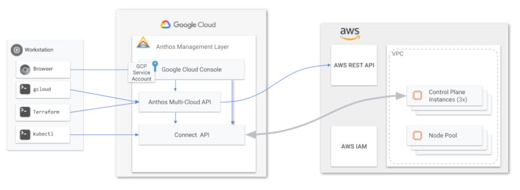

# Install GKE on AWS using Terraform

This script is meant to be a quick start to working with Anthos on AWS. For more information on Anthos Multi-Cloud please [click here](https://cloud.google.com/anthos/clusters/docs/multi-cloud/). This terraform script will install all relevant [IaaS prerequisites](https://cloud.google.com/anthos/clusters/docs/multi-cloud/aws/how-to/prerequisites) in AWS _(VPC, Subnets, Internet gateway, NAT gateway, IAM Roles, Route tables, and KMS)_.



 **The Terraform script deploys Anthos GKE with:**
- 3 control plane nodes _(1 in each AZ)_ of type [t3.medium](https://aws.amazon.com/ec2/instance-types/t3/).
- A single node pool of type [t3.medium](https://aws.amazon.com/ec2/instance-types/t3/) with 2 nodes in an autoscaling group to max 5 nodes to the AWS `us-east-1` region.

**Other information:**
- The node pool will be deployed to the `us-east-1a` zone.
- Supported instance types in AWS can be found [here](https://cloud.google.com/anthos/clusters/docs/multi-cloud/aws/reference/supported-instance-types).
- The network topology setup is documented [here](https://cloud.google.com/anthos/clusters/docs/multi-cloud/aws/how-to/create-aws-vpc#create-sample-vpc).
- You can adjust the region and AZs in the [variables.tf](/anthos-multi-cloud/AWS/variables.tf) file.
- For a list of AWS regions and associated K8s version supported per GCP region please use the following command:
```bash
gcloud container aws get-server-config --location [gcp-region]
```
After the cluster has been installed it will show up in the [Kubernetes Engine page](https://console.cloud.google.com/kubernetes/list/overview) of the GCP console in your relevant GCP project.

## Prerequisites

1. Ensure you have gCloud SDK 365.0.1 or greater [installed](https://cloud.google.com/sdk/docs/install)
```
gcloud components update
```

1. Install the AWS CLI

   Linux below, others can be found [here](https://docs.aws.amazon.com/cli/latest/userguide/getting-started-install.html)
   ```bash
   curl "https://awscli.amazonaws.com/awscli-exe-linux-x86_64.zip" -o "awscliv2.zip"
   unzip awscliv2.zip
   sudo ./aws/install --bin-dir /usr/local/bin --install-dir /usr/local/aws-cli --update
   ```

   Setup the AWS CLI with your [access key and secret](https://docs.aws.amazon.com/cli/latest/userguide/getting-started-prereqs.html#getting-started-prereqs-keys)
   ```bash
   aws configure
   ```

## Prepare Terraform
1. Configure GCP Terraform authentication.

   ```bash
   PROJECT_ID=Your GCP Project ID

   gcloud config set project "${PROJECT_ID}"
   gcloud auth application-default login --no-launch-browser
   ```

1. Enable services in your GCP project.

   ```bash
   gcloud --project="${PROJECT_ID}" services enable \
   gkemulticloud.googleapis.com \
   gkeconnect.googleapis.com \
   connectgateway.googleapis.com \
   cloudresourcemanager.googleapis.com \
   anthos.googleapis.com \
   logging.googleapis.com \
   monitoring.googleapis.com
   ```

1. Clone this repo and go into the AWS folder.

   ```bash
   git clone https://github.com/GoogleCloudPlatform/anthos-samples.git
   cd anthos-samples/anthos-multi-cloud/AWS
   ```


## Deploy Anthos Clusters(GKE) on AWS

1. Edit the following  values in the **terraform.tfvars** file. You can find the project number in the GCP console on the left side of the dashboard page. The admin user will be the GCP account email address that can login to the clusters once they are created via the connect gateway.

   ```bash
   gcp_project_id = "xxx-xxx-xxx"
   admin_user = "example@example.com"
   ```

1. Initialize and create terraform plan.

   ```bash
   terraform init
   ```

1. Apply terraform.

   ```bash
   terraform apply
   ```
     Once started the installation process will take about 12 minutes. **After the script completes you will see a var.sh file in the root directory that has varialbles for the anthos install** if you need to create more node pools manually in the future. Note manually created node pools will need to be deleted manually before you run terraform destroy

1. Authorize Cloud Logging / Cloud Monitoring

   Enable system container logging and container metrics. You can only do this after the first Anthos cluster has been created.
   ([read more](https://cloud.google.com/anthos/clusters/docs/multi-cloud/aws/how-to/create-cluster#telemetry-agent-auth))

   ``` bash
   gcloud projects add-iam-policy-binding ${PROJECT_ID} \
   --member="serviceAccount:${PROJECT_ID}.svc.id.goog[gke-system/gke-telemetry-agent]" \
   --role=roles/gkemulticloud.telemetryWriter
   ```

 1. Login to the Cluster

   ``` bash
   gcloud container hub memberships get-credentials [cluster name]
   kubectl get nodes
   ```
## Extra: Connect Anthos Configuration Management

If you would like to test out the Anthos Configuration and Policy Management feature you can visit this [quickstart](https://cloud.google.com/anthos-config-management/docs/archive/1.9/config-sync-quickstart).
## Delete Anthos on AWS Cluster

1. Run the following command to delete Anthos on AWS cluster.

   ```bash
   terraform destroy
   ```
